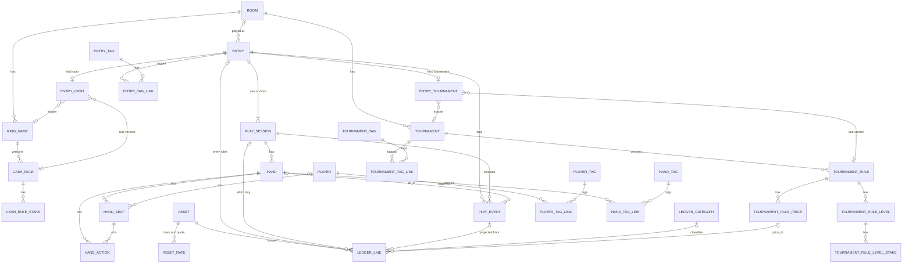
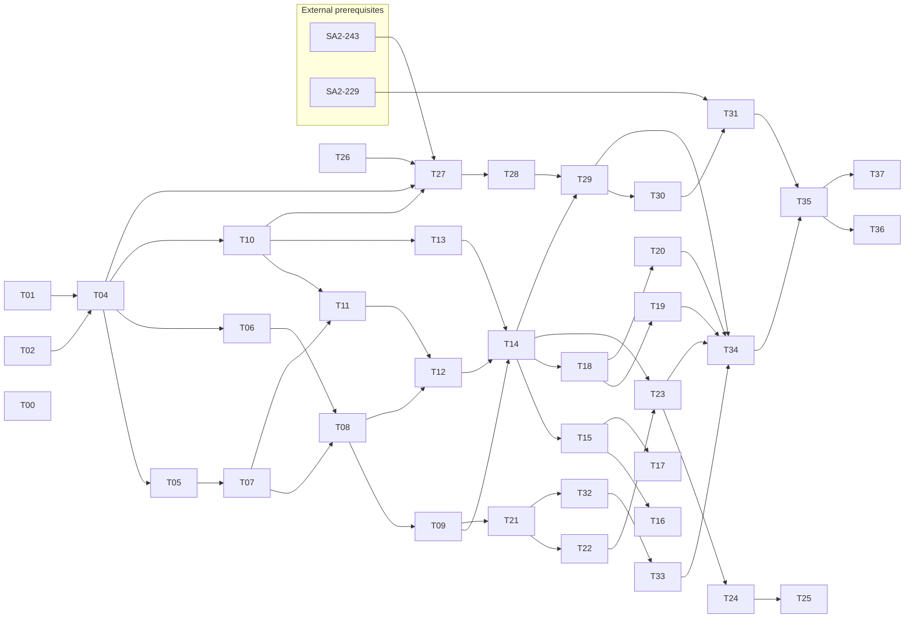

# Data Model v2

This is the specification and migration plan for data model v2. It replaces the current `game_session`-centered schema with five separate concerns: the unit of profit and loss (`entry`), the unit of time (`play_session`), asset movement (`ledger_line`), rule versions, and hand history. The migration runs in six phases (0 to 5) without stopping existing features, and each phase can ship on its own. Work is tracked in the Linear project "Data Model v2". Later implementation tasks treat this file as the source of truth.

## 1. Overview

This specification delivers three features: multi-day tournaments, non-currency buy-ins and results with conversion and virtual ROI, and live hand history. It does so with a table layout that never stores the same value in two places.

### Goals

- **G1 Multi-day**: One participation (`entry`) can have any number of per-day times (`play_session`). A re-entry counts as a detail line of the same `entry`.
- **G2 Assets and conversion**: Record participation and prizes paid in tickets or points. Compute virtual BI, virtual CO, and virtual ROI in a base currency.
- **G3 Hand history**: Record hands at three levels of detail (count, summary, full), including the live "+1". Support bb/100 and per-opponent tendencies.
- **G4 Integrity**: Put the P/L formula in one SQL place and remove summary copies (prevents a repeat of SA2-104, SA2-124, SA2-279). The database guarantees ownership through composite FKs.
- **G5 Extensibility**: New formats, assets, and events are added as rows or types.

### Non-goals

- Importing online hand history (P-SA2-6) and results (P-SA2-8). Only leave room for `entry.source = 'import'`.
- Staking (backing and markup). Only confirm that adding a value to `ledger_line.role` would cover it.
- A screen redesign. Existing screens keep the same look and read from a new source. Screens for new features are built minimally in each task.
- Sharing between users. All ownership stays within one user.

### Assumptions

- Cloudflare D1 (SQLite) and Drizzle. A statement binds at most 100 parameters. Atomicity across statements comes from `db.batch()`.
- The lineup tables of SA2-242 (game lineup, L0 to L6 = SA2-243 to SA2-251) are the foundation. Rule versions (section 5) replace the stake-table design of L1.
- The "own player row" of SA2-233 (`player.is_self`) represents Hero.
- Open questions (section 20) are decided provisionally with the recommended option. If a decision changes, fix the matching section.

## 2. Glossary

| Term | Definition | Current equivalent |
| --- | --- | --- |
| entry | The unit of money and result. One participation. P/L, ROI, and placement are counted here | game_session (money side) |
| play_session | A continuous period at the table. Day 1A, Day 2, cash play before and after leaving the seat | game_session (time side) |
| play_event | A fact from live input. Append-only. The source of projections | session_event |
| projection | Rows of the read model rebuilt from play_event: ledger lines, play_session times, placement | Recompute logic in each router |
| asset | Something that can move. A currency (money, points) or an item (tickets, etc.) | currency (currencies only) |
| asset_rate | The conversion rate between assets. An integer ratio with a validity period | None |
| ledger_line | One asset movement between the wallet and the table (the venue). Has a signed quantity, a role, and an effect | currency_transaction and the amount columns |
| role | The purpose of a ledger line, such as buy_in or prize (section 11) | Column names (buy_in, prize_money, etc.) |
| effect | Whether a ledger line moves the balance. real moves it, virtual does not | None |
| base currency | The currency that conversion and totals target. One per user setting | Currency choice in statistics |
| real P/L | The sum of real ledger lines in currencies only | profitLoss |
| virtual P/L | The sum of all lines valued in the base currency. Items use their unit price, and virtual lines are included | Virtual P/L in PR #569 |
| rule version | One row of cash_rule / tournament_rule. Never updated after it is written | Copied columns in session_*_detail |
| current version | The version that a master's current_rule_id points to | Column on ring_game / tournament |
| end_state | How a play_session ended: bagged / held / busted / cashed_out / finished | None (only status = completed) |
| hand.detail | The level of detail of a hand record: count / summary / full | game_session.hand_count |
| composite FK | A foreign key that references the parent by (parent_id, user_id). It cannot point to another user's row | game_mix_variant only |

## 3. Overview of the final shape



The `entry` handles money and results, `play_session` handles time, `ledger_line` handles money movement, and `hand` handles what happens at the table. Masters can be edited, but a rule version never changes once written. The diagram shows only the main FKs and leaves out the `user_id` half of every composite FK. `tournament_tag` is built as `tournament_tag_def` until the P5 rename (section 10).

## 4. Invariants

There are 23 invariants. Implementation, review, and audit queries refer to them by ID (INV-xx). "DB" means a constraint. "API" means server-side validation. "Audit" means an audit query in section 16 that must return 0 rows.

| ID | Invariant | Enforced by |
| --- | --- | --- |
| INV-01 | Every app table has `user_id NOT NULL`. References to a parent are composite FKs on `(parent_id, user_id)` | DB |
| INV-02 | A reference column added to an existing table with ADD COLUMN is a single-column FK (the 6 columns in the exception table in section 5). Ownership is enforced by the server and by audits | API, audit |
| INV-03 | An entry has one or more play_sessions. `entry.played_on` equals `MIN(play_session.local_date)` | API, audit |
| INV-04 | `play_session.seq` is a sequence starting at 1 within an entry, and `(entry_id, seq)` is unique | DB, API |
| INV-05 | Each user has at most one unfinished play_session (`status <> 'ended'`) | DB (partial UNIQUE) |
| INV-06 | `entry.status = 'settled'` only when both hold: (1) all play_sessions are ended, and (2) the end_state of the row with the highest seq is busted / cashed_out / finished. A manual-input entry is always settled | DB (manual), API, audit |
| INV-07 | Allowed end_state and kind pairs: bagged and busted for tournament only, held and cashed_out for cash only, finished for both. bagged and held require `end_stack` | DB, API |
| INV-08 | `ledger_line.quantity <> 0`. The sign is determined by role (section 11) | DB |
| INV-09 | A line with an entry-owned role has `entry_id NOT NULL`. A line with a wallet role (adjustment / exchange) has `entry_id IS NULL` | DB |
| INV-10 | A line with `effect = 'virtual'` belongs to an entry and does not count toward balance or real P/L | DB, calculation |
| INV-11 | An exchange is a pair of two lines sharing `transfer_id`. The assets differ and the signs are opposite | API, audit |
| INV-12 | A line with `source_event_id` is a projection and is not edited directly. When the source event changes, rebuild it in the same `db.batch` | API |
| INV-13 | An entry with `source = 'manual'` has no play_event and no line with `source_event_id` | API, audit |
| INV-14 | For a live entry, all of these values are projections from play_event: play_session times, break, status, and end_state; placement and total entries in entry_tournament; and `entry_cash.ev_diff` | API |
| INV-15 | The play_session of a ledger line or an event belongs to that row's entry | DB (3-column composite FK) |
| INV-16 | Rule versions (cash_rule / tournament_rule and their child tables) are INSERT-only. Editing a master creates a new version and repoints `current_rule_id` | API |
| INV-17 | The owner of a rule version referenced by an entry or master is the same as the owner of the referencing row | API, audit |
| INV-18 | `hand.hand_no` is a sequence starting at 1 within a play_session and is unique. The hand count is the row count, and the current button is `button_seat` of the row with the highest hand_no | DB, API |
| INV-19 | A hand has at most one Hero seat. seat is 0 to 9 (MAX_SEAT_POSITION). The seat of a hand_action exists in that hand's hand_seat | DB |
| INV-20 | A tag name is unique per user and kind, ignoring case. A link has a composite FK to both the tag and the target | DB |
| INV-21 | Conversion uses only asset_rate. Each line uses the latest rate with `effective_from <= occurred_at` | Calculation |
| INV-22 | A referenced master cannot be physically deleted (room, ring_game, tournament, asset, ledger_category, player). The FK rejects it with NO ACTION, and the API points to archive. A ring_game or tournament is referenced when an entry links it or uses one of its rule versions; its own versions do not count and are deleted with it (§5.4) | DB, API |
| INV-23 | JSON columns have a `json_valid` CHECK and are used only for immutable values (event payload, `hand.stakes`) (SA2-214) | DB |

## 5. Table definitions 1: conventions, masters, rule versions

Every new table follows the common conventions below. The per-table definitions omit these common columns. The existing parent tables (room, ring_game, tournament, currency, player, player_tag) keep being used. ring_game and tournament are rebuilt once in P0 (T02) to get `user_id NOT NULL` and a composite FK to room, with their child rows staged and restored (16.3). The others only get columns and indexes added.

### 5.1 Common conventions

- `id TEXT PRIMARY KEY`: `crypto.randomUUID()`. A row created by backfill uses the same id as its source row, or a prefixed deterministic id (section 16).
- `user_id TEXT NOT NULL`: `user(id) ON DELETE CASCADE`.
- `created_at` / `updated_at INTEGER NOT NULL`: unixepoch seconds. An immutable table has only `created_at`.
- A table referenced by a composite FK has `UNIQUE (id, user_id)`. Without this index, deleting a parent fails with `foreign key mismatch` (confirmed in SA2-242).
- ON DELETE uses only these two behaviors. Do not use RESTRICT or SET NULL.
  - CASCADE for children of the same aggregate (entry to play_session, etc.).
  - NO ACTION for references to masters and rule versions. The one exception is a rule version's reference to the master that owns it, which is CASCADE (§5.4).
- Why SET NULL is not used: a composite FK with SET NULL tries to set `user_id` to NULL as well, and fails.
- Amounts and counts are INTEGER. Store them in the smallest unit of the asset. The sign is decided per column.
- A date-only value is `TEXT 'YYYY-MM-DD'` (`local_date`, `played_on`). A time is unixepoch seconds.
- An enumerated value is TEXT with a CHECK. The list of values is in section 11.

### 5.2 Changes to existing masters

| Table | Change | Phase |
| --- | --- | --- |
| room | Add `archived_at INTEGER NULL`. Add `UNIQUE (id, user_id)`. A room can be deleted only when nothing references it | P0 |
| ring_game | Rebuild with `user_id NOT NULL` and the composite FK `(room_id, user_id) → room(id, user_id) ON DELETE CASCADE` (the existing cascade; T01 refuses a referenced room at the API). Add `UNIQUE (id, user_id)`. A row with a NULL `user_id` takes its room's owner, or else the owner of the oldest session that links it; a row with neither is linked by nothing and is deleted. A row whose room belongs to another user keeps its own owner and loses the room link | P0 (T02) |
| ring_game | Add `current_rule_id` (exception table). Keep `currency_id` as the "default asset". The Drizzle property name is `defaultAssetId` | P4 |
| ring_game | DROP COLUMN the rule columns: variant, mix_games, blind1 to blind3, ante, ante_type, min_buy_in, max_buy_in, table_size, house_rules (none has an FK) | P4 (SA2-251) |
| tournament | Rebuild with `user_id TEXT NOT NULL REFERENCES user(id) ON DELETE CASCADE`, filled from room, and the composite FK `(room_id, user_id) → room(id, user_id) ON DELETE CASCADE`. Add `UNIQUE (id, user_id)` | P0 (T02) |
| tournament | Add `current_rule_id` (exception table). DROP COLUMN buy_in, entry_fee, starting_stack, bounty_amount, table_size, house_rules, variant | P4 |
| blind_level, tournament_chip_purchase | Move to tournament_rule_level and tournament_rule_price, then drop the tables. They are child tables, so they can be dropped | P4 |
| player | Add `UNIQUE (id, user_id)`. A row referenced by hand_seat cannot be deleted | P0 |
| player_tag | Add `UNIQUE (id, user_id)`. After auditing duplicate names, add `UNIQUE (user_id, lower(name))` | P0 / P5 |
| currency | Extend it as asset (section 7). Rename the table to asset at the end | P2 / P5 |

### 5.3 Exception table for composite FKs (INV-02)

SQLite's ADD COLUMN cannot add a composite FK. So the following 6 columns are single-column FKs. On write, `validateEntityOwnership` checks the owner. The audit queries in section 16 check that none points to another user's row.

| Column | References | ON DELETE | Phase |
| --- | --- | --- | --- |
| `ring_game.current_rule_id` | cash_rule(id) | NO ACTION | P4 |
| `tournament.current_rule_id` | tournament_rule(id) | NO ACTION | P4 |
| `entry_cash.cash_rule_id` | cash_rule(id) | NO ACTION | P4 |
| `entry_tournament.tournament_rule_id` | tournament_rule(id) | NO ACTION | P4 |
| `ledger_line.price_id` | tournament_rule_price(id) | NO ACTION | P4 |
| `play_event.hand_id` | hand(id) | NO ACTION | P3 |

### 5.4 Rule versions (P4, refers to the SA2-242 lineups)

Every rule-version table is INSERT-only and is never updated (INV-16). The definitions of game_lineup / game_lineup_group follow game-lineups.md.

**cash_rule**

| Column | Type | Nullable | Constraints and description |
| --- | --- | --- | --- |
| ring_game_id | TEXT | yes | The master that owns this version. `(ring_game_id, user_id)` to ring_game, CASCADE: the versions belong to the master's aggregate, and entries that use them keep the master from being deleted (INV-22). NULL for manual input without a master |
| parent_rule_id | TEXT | yes | The version this one is based on. `(parent_rule_id, user_id)` to cash_rule, NO ACTION |
| lineup_id | TEXT | no | `(lineup_id, user_id)` to game_lineup, NO ACTION |
| min_buy_in / max_buy_in | INTEGER | yes | Both 0 or more. `min_buy_in <= max_buy_in` (SA2-277) |
| table_size | INTEGER | yes | 2 to 10 |
| house_rules | TEXT | yes | Up to 2,000 characters |

Indexes: `UNIQUE (id, user_id)`, `UNIQUE (id, lineup_id)`, `(ring_game_id)`, `(parent_rule_id)`.

**cash_rule_stake** (primary key `(rule_id, lineup_group_id)`)

| Column | Type | Nullable | Constraints and description |
| --- | --- | --- | --- |
| rule_id | TEXT | no | `(rule_id, user_id)` and `(rule_id, lineup_id)` to cash_rule, CASCADE. The second FK ties the stake to its version's lineup |
| lineup_group_id | TEXT | no | `(lineup_group_id, lineup_id)` to game_lineup_group. One row per group (invariant 5 in game-lineups.md) |
| lineup_id | TEXT | no | The same lineup as the parent cash_rule. Held for the two composite FKs, so a stake cannot point at a group of another lineup |
| blind1 / blind2 / blind3 / ante | INTEGER | yes | All 0 or more |
| ante_type | TEXT | yes | The same set of values as the current ante_type |

**tournament_rule**

| Column | Type | Nullable | Constraints and description |
| --- | --- | --- | --- |
| tournament_id | TEXT | yes | The master that owns this version. `(tournament_id, user_id)` to tournament, CASCADE, as on cash_rule |
| parent_rule_id | TEXT | yes | `(parent_rule_id, user_id)` to tournament_rule, NO ACTION |
| lineup_id | TEXT | no | The default lineup for the whole tournament |
| starting_stack | INTEGER | yes | 0 or more |
| table_size | INTEGER | yes | 2 to 10 |
| bounty_amount | INTEGER | yes | 0 or more |
| house_rules | TEXT | yes | Up to 2,000 characters |

Indexes: `UNIQUE (id, user_id)`, `(tournament_id)`, `(parent_rule_id)`.

**tournament_rule_level**

| Column | Type | Nullable | Constraints and description |
| --- | --- | --- | --- |
| rule_id | TEXT | no | `(rule_id, user_id)` to tournament_rule, CASCADE |
| ordinal | INTEGER | no | Sort order starting at 1. `UNIQUE (rule_id, ordinal)` |
| level | INTEGER | yes | The level number shown to the user. NULL for a break |
| is_break | INTEGER | no | 0 / 1 |
| minutes | INTEGER | yes | 1 or more |
| lineup_id | TEXT | no | The effective lineup. `(lineup_id, user_id)` to game_lineup, NO ACTION. Equals the version's lineup_id while inherits_lineup = 1 (API) |
| inherits_lineup | INTEGER | no | 0 / 1. 1 = the level follows the version's default lineup, and the API returns `game: null` for it (SA2-242 decision 2, kept in SA2-297) |

Indexes: `UNIQUE (id, user_id)`, `UNIQUE (id, lineup_id)`.

**tournament_rule_level_stake** (primary key `(level_id, lineup_group_id)`): the same shape as cash_rule_stake, except the parent is tournament_rule_level — `(level_id, user_id)` and `(level_id, lineup_id)` to tournament_rule_level, CASCADE. A NULL lineup on an inheriting level would leave these rows outside the lineup FK, which is why the level stores its effective lineup. A break level has no rows.

**tournament_rule_price**

| Column | Type | Nullable | Constraints and description |
| --- | --- | --- | --- |
| rule_id | TEXT | no | `(rule_id, user_id)` to tournament_rule, CASCADE |
| kind | TEXT | no | entry / reentry / chip_purchase |
| label | TEXT | no | Display name ("Add-on", "Rebuy", etc.). Up to 50 characters |
| asset_id | TEXT | yes | The asset used to pay. NULL means the entry's main currency. For a ticket, the item asset. `(asset_id, user_id)` to asset, NO ACTION |
| cost | INTEGER | no | 0 or more. For a ticket, the number of tickets |
| fee | INTEGER | no | Default 0. 0 or more. In the same unit as the paying asset |
| chips | INTEGER | yes | The number of chips received. 0 or more if entered |
| ordinal | INTEGER | no | Sort order. `UNIQUE (rule_id, ordinal)` |

If a tournament can be entered with either cash or a ticket, keep two rows with kind = entry (cash: "cost 20,000 / fee 2,000", ticket: "cost 1 / fee 0"). When an entry without a master has a "rule for this one time only", it is also stored in the same tables as a version with no parent.

## 6. Table definitions 2: entry and play_session (P1)

entry and play_session are backfilled with the same id as the old game_session (the play_session with seq 1 also gets that id). So the URL `/sessions/:id`, the MCP session id, and the values that events refer to do not change.

**entry**

| Column | Type | Nullable | Default | Constraints and description |
| --- | --- | --- | --- | --- |
| kind | TEXT | no | — | cash / tournament |
| source | TEXT | no | — | live / manual / import |
| status | TEXT | no | — | open / settled. `source <> 'manual' OR status = 'settled'` |
| room_id | TEXT | yes | — | `(room_id, user_id)` to room, NO ACTION |
| asset_id | TEXT | yes | — | The main currency. Used as the default for display, EV, and the paying asset. `(asset_id, user_id)` to asset, NO ACTION |
| title | TEXT | yes | — | The display name when there is no master. Up to 100 characters. When there is a master, look up its name each time |
| played_on | TEXT | no | — | A projection of `MIN(play_session.local_date)` (INV-03). Used for list sorting and paging |
| memo | TEXT | yes | — | Up to 5,000 characters |

Indexes: `UNIQUE (id, user_id)`, `(user_id, played_on, id)` (keyset paging), `(user_id, kind, status)`, `(room_id)`, `(asset_id)`. CHECK: `played_on GLOB '[0-9][0-9][0-9][0-9]-[0-9][0-9]-[0-9][0-9]'`.

**entry_cash** (1:1 with entry, kind = cash)

| Column | Type | Nullable | Constraints and description |
| --- | --- | --- | --- |
| entry_id | TEXT | no | Primary key. `(entry_id, user_id)` to entry, CASCADE |
| ring_game_id | TEXT | yes | `(ring_game_id, user_id)` to ring_game, NO ACTION |
| ev_diff | INTEGER | yes | EV P/L minus real P/L. NULL means EV was not recorded (the same meaning as the current evCashOut) |
| cash_rule_id | TEXT | yes | An exception column added in P4. After the P4 read switch, the server makes it required |

**entry_tournament** (1:1 with entry, kind = tournament)

| Column | Type | Nullable | Constraints and description |
| --- | --- | --- | --- |
| entry_id | TEXT | no | Primary key. `(entry_id, user_id)` to entry, CASCADE |
| tournament_id | TEXT | yes | `(tournament_id, user_id)` to tournament, NO ACTION |
| placement | INTEGER | yes | 1 or more. At most total_entries |
| total_entries | INTEGER | yes | 1 or more |
| before_deadline | INTEGER | yes | 0 / 1. When 1, placement is NULL (the same rule as the current end payload) |
| tournament_rule_id | TEXT | yes | An exception column added in P4 |

The number of entrants and remaining players during play stay in update_stack events, as today. entry_tournament holds only the final result.

**play_session**

| Column | Type | Nullable | Default | Constraints and description |
| --- | --- | --- | --- | --- |
| entry_id | TEXT | no | — | `(entry_id, user_id)` to entry, CASCADE |
| seq | INTEGER | no | — | 1 or more. `UNIQUE (entry_id, seq)` |
| label | TEXT | yes | — | "Day 1A", etc. Up to 50 characters |
| local_date | TEXT | no | — | The user's local date `YYYY-MM-DD`. Sent by the client |
| started_at | INTEGER | yes | — | Can be omitted in manual input |
| ended_at | INTEGER | yes | — | `ended_at >= started_at` |
| break_minutes | INTEGER | no | 0 | 0 or more |
| status | TEXT | no | — | active / paused / ended |
| end_state | TEXT | yes | — | `(status = 'ended') = (end_state IS NOT NULL)`. Values are in section 11 |
| end_stack | INTEGER | yes | — | 0 or more. Required for bagged and held (INV-07). Becomes the starting stack of the next play_session |
| clock_started_at | INTEGER | yes | — | The start time of the tournament timer (the current timerStartedAt) |
| clock_start_level | INTEGER | yes | — | The ordinal of the level at which that day started. For example, when Day 2 starts at level 15 |

Indexes:

- `UNIQUE (id, user_id)`, `UNIQUE (id, entry_id, user_id)` (the target of the 3-column composite FK, INV-15)
- `UNIQUE (user_id) WHERE status <> 'ended'` (INV-05. The successor of the old `session_one_unfinished_live_per_user_idx`)
- `(user_id, local_date)`

A manual-input play_session is always created with `status = 'ended'`, so it never hits the partial UNIQUE. Its end_state is cashed_out for cash, and busted (with a placement) or finished for a tournament.

When a player leaves a cash game while holding a stack, the shape is "close with held and add a new play_session". This replaces the current reopen (which deletes the end event and adds update_stack and pause / resume).

## 7. Table definitions 3: assets, conversion rates, ledger (P2)

Currencies and items live in one asset table, and every asset movement is recorded as one `ledger_line` row.

The asset table is not created new. It adds columns to the existing currency table, for two reasons (both confirmed on SQLite 3.53):

- The `currency_id` of ring_game and tournament is a table-level FK and cannot be dropped with DROP COLUMN.
- ring_game and tournament are parent tables, so rebuilding them would cascade-delete child rows.

The table is renamed in P5 with `ALTER TABLE currency RENAME TO asset`. We confirmed that RENAME also rewrites the FK definitions of child tables to the new name. This section uses the post-rename name (asset).

**asset** (formerly currency. Existing columns: name, unit, description, is_favorite)

| Column | Type | Nullable | Default | Constraints and description |
| --- | --- | --- | --- | --- |
| kind | TEXT | no | 'currency' | currency / item. Added with ADD COLUMN |
| decimals | INTEGER | no | 0 | 0 to 4. Used for display only (2 if USD is held in cents) |
| archived_at | INTEGER | yes | — | Only removes the asset from candidates for new input. References still resolve |

Indexes: `UNIQUE (id, user_id)`, `(user_id, kind)`. Name uniqueness is added later as `UNIQUE (user_id, lower(name))`, after auditing existing data.

**asset_rate** (immutable. To correct one, delete the row with the same effective_from and insert it again)

| Column | Type | Nullable | Constraints and description |
| --- | --- | --- | --- |
| base_asset_id | TEXT | no | `(base_asset_id, user_id)` to asset, CASCADE |
| quote_asset_id | TEXT | no | `(quote_asset_id, user_id)` to asset, CASCADE. `base_asset_id <> quote_asset_id` |
| rate_num | INTEGER | no | 1 to 10^12. One smallest unit of base = rate_num / rate_den smallest units of quote |
| rate_den | INTEGER | no | 1 to 10^12 |
| effective_from | INTEGER | no | Valid from this time. 0 (1970-01-01) means "valid from the beginning" and matches every line. It is not NULL because UNIQUE does not treat NULLs as duplicates, so two "from the beginning" rows could enter the same pair. `UNIQUE (user_id, base_asset_id, quote_asset_id, effective_from)` |
| memo | TEXT | yes | Source, etc. |

The unit price of an item is also held in asset_rate. If 1 Main ticket = 20,000 pt, the row has base = Main ticket, quote = pt, `rate_num = 20000`, `rate_den = 1`. If the unit price changes over time, the history is kept. The `asset.unit_value` column from the overview version is not created.

A fixed rate is expressed by registering a single row with effective_from = 0. If the fixed value changes later, add a row at the time of the change. A line older than the first row's effective_from of a pair cannot be converted (section 12.2), so the screen defaults the first row of a pair to "valid from the beginning". Correcting a row with effective_from = 0 changes the valuation of all periods, so warn the user before saving.

**ledger_category** (the old transaction_type, moved with the same id)

| Column | Type | Nullable | Constraints and description |
| --- | --- | --- | --- |
| name | TEXT | no | Up to 50 characters. `UNIQUE (user_id, lower(name))` |
| archived_at | INTEGER | yes | — |

The row with the reserved name "Session Result" is not moved, because a session result becomes an entry's ledger lines.

**ledger_line**

| Column | Type | Nullable | Constraints and description |
| --- | --- | --- | --- |
| asset_id | TEXT | no | `(asset_id, user_id)` to asset, NO ACTION |
| quantity | INTEGER | no | A signed quantity from the wallet's point of view. `quantity <> 0`, absolute value at most 10^12. The sign is decided by role |
| role | TEXT | no | One of the 11 values in section 11 |
| effect | TEXT | no | real / virtual. virtual requires entry_id |
| entry_id | TEXT | yes | `(entry_id, user_id)` to entry, CASCADE. Required for entry roles, NULL for wallet roles (INV-09) |
| play_session_id | TEXT | yes | `(play_session_id, entry_id, user_id)` to play_session, CASCADE. Says which day the event belongs to |
| source_event_id | TEXT | yes | `(source_event_id, user_id)` to play_event, CASCADE. The projection source. NULL for manual input |
| price_id | TEXT | yes | An exception column added in P4 (T27). Which price was paid. The number of chip purchases is counted by this column |
| category_id | TEXT | yes | `(category_id, user_id)` to ledger_category, NO ACTION. Used only by adjustment and exchange |
| transfer_id | TEXT | yes | Pairs the two rows of an exchange. Required for exchange |
| occurred_at | INTEGER | no | The reference time for choosing the conversion rate. For live, the event time. For manual, the start time or noon of local_date |
| memo | TEXT | yes | Up to 500 characters |

CHECKs (all enforced by the DB):

- `quantity <> 0 AND abs(quantity) <= 1000000000000`
- Role and sign: a payment role (buy_in, reentry, fee, chip_purchase, addon) has `quantity < 0`, and a receipt role (cash_out, chip_remove, prize, bounty) has `quantity > 0`
- A wallet role (adjustment, exchange) has `entry_id IS NULL AND effect = 'real'`, and every other role has `entry_id IS NOT NULL`
- `role <> 'exchange' OR transfer_id IS NOT NULL`
- `play_session_id IS NULL OR entry_id IS NOT NULL`

Indexes: `(user_id, entry_id)`, `(user_id, asset_id, occurred_at)` (balance and history), `(source_event_id)`, `(play_session_id)`, `(transfer_id)`.

**user_setting** (new. One row per user)

| Column | Type | Nullable | Constraints and description |
| --- | --- | --- | --- |
| user_id | TEXT | no | Primary key. user(id), CASCADE |
| base_asset_id | TEXT | yes | The base currency. `(base_asset_id, user_id)` to asset, NO ACTION. The server checks that kind = currency |
| time_zone | TEXT | yes | An IANA name (for example Asia/Tokyo). Defaults to the browser's value. Used to fill in local_date when it is not sent |
| updated_at | INTEGER | no | — |

## 8. Table definitions 4: event log (P1)

play_event is the old session_event moved with the same id. It is the only place that keeps the facts of live input, and it can be edited and deleted. After a change, rebuild the projection in the same batch.

**play_event**

| Column | Type | Nullable | Default | Constraints and description |
| --- | --- | --- | --- | --- |
| entry_id | TEXT | no | — | `(entry_id, user_id)` to entry, CASCADE |
| play_session_id | TEXT | no | — | `(play_session_id, entry_id, user_id)` to play_session, CASCADE (INV-15) |
| type | TEXT | no | — | The event type in section 11. No CHECK. The server's Zod registry validates it, so adding a type does not need a migration |
| schema_version | INTEGER | no | 1 | The payload version. 1 is the existing shape, 2 is the shape with a payments array |
| occurred_at | INTEGER | no | — | — |
| sort_order | INTEGER | no | — | `UNIQUE (entry_id, sort_order)`. Appends are numbered the same way as the current `nextAppendSortOrderSql` |
| payload | TEXT | no | — | `CHECK (json_valid(payload))` |
| hand_id | TEXT | yes | — | An exception column added with ADD COLUMN in P3. Links all_in to a hand |

Indexes: `UNIQUE (id, user_id)`, `(play_session_id, sort_order)`.

- Why sort_order is per entry: the event order stays one sequence across play_sessions, so the event log screen works as it does today.
- Deleting a play_session cascades to its events and projected lines. Only the play_session with the highest seq can be deleted (API).
- The seat state (session_table_player) is built from player_join / player_leave events, as today. No seat table is created. A new play_session takes the last seats of the previous play_session as its initial state.

## 9. Table definitions 5: hand history (P3)

A hand is a child of play_session. Every hand, including the "+1", is recorded as one row. Its details can be raised to summary or full later.

**hand**

| Column | Type | Nullable | Constraints and description |
| --- | --- | --- | --- |
| play_session_id | TEXT | no | `(play_session_id, user_id)` to play_session, CASCADE |
| hand_no | INTEGER | no | 1 or more. `UNIQUE (play_session_id, hand_no)` |
| played_at | INTEGER | yes | The time of the "+1". NULL for backfilled rows |
| detail | TEXT | no | count / summary / full |
| button_seat | INTEGER | yes | 0 to 9 |
| table_size | INTEGER | yes | 2 to 10 |
| level_ordinal | INTEGER | yes | The tournament level |
| stakes | TEXT | yes | `{"sb","bb","ante","straddle"}` at that moment. `json_valid` |
| variant_id | TEXT | yes | Which game in a mix. `(variant_id, user_id)` to game_variant, NO ACTION |
| board | TEXT | yes | Cards separated by spaces (for example `Ah Kd 7c 2s 9h`). At most 5 cards |
| pot | INTEGER | yes | 0 or more (chips) |
| hero_net | INTEGER | yes | Hero's chip result (signed) |
| memo | TEXT | yes | Up to 2,000 characters |

Indexes: `UNIQUE (id, user_id)`, `(user_id, played_at)`.

**hand_seat** (primary key `(hand_id, seat)`)

| Column | Type | Nullable | Default | Constraints and description |
| --- | --- | --- | --- | --- |
| hand_id | TEXT | no | — | `(hand_id, user_id)` to hand, CASCADE |
| seat | INTEGER | no | — | 0 to 9 |
| player_id | TEXT | yes | — | `(player_id, user_id)` to player, NO ACTION. NULL for an unknown opponent |
| is_hero | INTEGER | no | 0 | 0 / 1. `UNIQUE (hand_id) WHERE is_hero = 1` (INV-19) |
| start_stack | INTEGER | yes | — | 0 or more |
| hole_cards | TEXT | yes | — | For example `As Kd`. Up to 7 cards (Stud) |
| net | INTEGER | yes | — | The chip result of that seat |
| showed | INTEGER | no | 0 | 0 / 1 |

**hand_action** (primary key `(hand_id, seq)`)

| Column | Type | Nullable | Constraints and description |
| --- | --- | --- | --- |
| hand_id | TEXT | no | `(hand_id, user_id)` to hand, CASCADE |
| seq | INTEGER | no | A sequence starting at 1 |
| street | INTEGER | no | 0 to 7. 0 is preflop. The name is looked up per game |
| seat | INTEGER | no | `(hand_id, seat)` to hand_seat, CASCADE (INV-19) |
| action | TEXT | no | One of the 11 values in section 11 |
| amount | INTEGER | yes | 0 or more. The chips added by that action |
| all_in | INTEGER | no | 0 / 1. Default 0 |

A card is written as two characters: a rank `[2-9TJQKA]` and a suit `[shdc]`. The server's Zod validates the format, and the DB has only a length CHECK.

About the D1 limit:

- hand_seat has 9 columns and hand_action has 8 (both including user_id). `chunkForInsert` derives the width from the column count: 11 rows at a time for hand_seat (99 parameters) and 12 rows for hand_action (96 parameters).
- Saving one hand (updating hand, replacing seats and actions) goes into a single `db.batch`.

What each detail level holds:

- count: only the hand row
- summary: one hand_seat row for Hero, plus board, pot, hero_net, and memo
- full: hand_seat rows for all seats and hand_action rows

When lowering detail, delete the matching child rows in the same batch.

## 10. Table definitions 6: tags and others (P5)

For each target kind, tags have two tables of the same shape (a tag table and a link table) (decided on 2026-10-05). The tables are created by the factory `defineTagTables()` and the routers by the factory `createTagRouter()`. Only the extra columns for each kind are passed as arguments.

| Tag table | Link table | Extra columns | Migrated from |
| --- | --- | --- | --- |
| entry_tag | entry_tag_link (entry_id, tag_id) | None | session_tag, moved with the same id. session_to_session_tag becomes the links |
| player_tag (the existing table is used) | player_tag_link (player_id, tag_id) | Tag: color. Link: position | player_to_player_tag, rebuilt with user_id |
| tournament_tag_def (renamed to tournament_tag in the P5 rename) | tournament_tag_link (tournament_id, tag_id) | None | The old tournament_tag (a string per tournament), grouped per user by `lower(trim(name))` |
| hand_tag | hand_tag_link (hand_id, tag_id) | Link: reviewed_at | New |

Common columns of a tag table:

- `name TEXT NOT NULL` (up to 50 characters)
- `sort_order INTEGER NOT NULL DEFAULT 0`
- Indexes: `UNIQUE (id, user_id)`, `UNIQUE (user_id, lower(name))`

Common columns of a link table:

- `(target_id, tag_id, user_id)`, primary key `(target_id, tag_id)`
- FKs: `(tag_id, user_id)` to the tag table, `(target_id, user_id)` to the target. Both CASCADE
- Index: `(tag_id)`

Because the old tournament_tag already uses that name, the per-user tournament tag table is created as tournament_tag_def. After the old table is dropped, it is renamed to tournament_tag in the same release as currency to asset (section 16, P5).

Classifications that can be derived are not tags. Bounty is computed from bounty_amount, and Turbo from the level minutes, on the statistics side.

**Other changes**

- filter_preset: add `entryTagIds` and `tournamentTagIds` to `payload`. No table change. An old payload can be read through the Zod defaults.
- player: once `is_self` from SA2-233 lands, put the user's own player row into Hero's hand_seat.player_id. Until then, represent Hero with is_hero = 1 and player_id = NULL.

**Old tables dropped in P5** (drop from children first)

1. session_chip_purchase_result, session_chip_purchase, session_blind_level
2. session_to_session_tag, currency_transaction
3. session_cash_detail, session_tournament_detail, session_event
4. game_session, session_tag, transaction_type
5. tournament_tag (old), player_to_player_tag
6. blind_level, tournament_chip_purchase (dropped in T31 of P4, not in P5)

None of these tables is referenced by the new tables. So the implicit DELETE of DROP TABLE never removes rows of the new tables.

## 11. Enumerated values

Enumerated values live as `as const` arrays in `packages/db/src/constants/`. Both the CHECK constraints and Zod are generated from them.

### 11.1 entry and play_session

| Column | Values |
| --- | --- |
| entry.kind | cash, tournament (later sng, spin, home, etc. Then add an entry_\<kind> table) |
| entry.source | live, manual, import |
| entry.status | open, settled |
| play_session.status | active, paused, ended |
| asset.kind | currency, item |
| ledger_line.effect | real, virtual |
| hand.detail | count, summary, full |
| tournament_rule_price.kind | entry, reentry, chip_purchase |

### 11.2 play_session.end_state

| Value | kind | Meaning | Next state of the entry |
| --- | --- | --- | --- |
| bagged | tournament | Survived the day and bagged the chips. end_stack is required | open (waiting for the next day) |
| held | cash | Left the seat while holding a stack. end_stack is required | open (waiting to resume) |
| busted | tournament | Eliminated. The placement goes into entry_tournament | settled (open again when a re-entry follows, section 13.3) |
| cashed_out | cash | Cashed out and finished | settled |
| finished | both | Finished by winning, a deal, etc. Also the default for manual input | settled |

### 11.3 ledger_line.role

| role | Sign | Belongs to | kind | Meaning | Current column |
| --- | --- | --- | --- | --- | --- |
| buy_in | − | entry | both | The first participation fee (for cash, the first buy-in) | buy_in, tournament_buy_in |
| reentry | − | entry | tournament | The participation fee of a re-entry | None |
| fee | − | entry | tournament | The fee. Written as a pair with buy_in or reentry | entry_fee |
| chip_purchase | − | entry | tournament | Rebuy, add-on, etc. Points to the price table with price_id | session_chip_purchase × count |
| addon | − | entry | cash | An additional buy-in | chips_add_remove (positive) |
| chip_remove | + | entry | cash | Took chips off the table during play | chip_remove_total |
| cash_out | + | entry | cash | Cash-out | cash_out |
| prize | + | entry | tournament | Prize money. Includes items such as tickets | prize_money |
| bounty | + | entry | tournament | Bounty | bounty_prizes |
| adjustment | ± | wallet | — | Deposits, withdrawals, etc. Classified by category_id | currency_transaction (non-session) |
| exchange | ± | wallet | — | Currency exchange. Two rows are paired by transfer_id | None |

When a player leaves chips with the venue in a cash game, leaving them is a cash_out and drawing them to use is a buy_in. To manage the venue balance as an asset, create a "held by venue" asset and move value to it with exchange.

### 11.4 Event types

| type | Applies to | payload (schema_version 2) | Change |
| --- | --- | --- | --- |
| session_start | both | `{ payments?: Payment[], timerStartedAt?, startLevel? }`. The v1 `buyInAmount` is read as one buy_in row in the main currency | Existing. Generalized in v2 |
| session_end | both | For cash, `{ payments: Payment[] }`. For a tournament, the v1 columns plus `payments`. Settles the entry | Existing. Generalized in v2 |
| day_end | both | `{ endState: 'bagged' \| 'held', stackAmount }`. Closes only the play_session | New |
| reentry | tournament | `{ payments: Payment[] }` | New |
| table_change | both | `{ tableLabel?: string, seatPosition? }`. Has no projection | New |
| session_pause / session_resume | both | `{}` | Unchanged |
| chips_add_remove | cash | `{ amount }`. Positive is addon, negative is chip_remove | Unchanged |
| all_in | cash | `{ potSize, trials, equity, wins, handId? }` | `handId` added |
| purchase_chips | tournament | `{ priceId, label, chips, payments }`. v1 has `sessionChipPurchaseId` and `cost` | v2 refers to the price table |
| update_stack | both | `{ stackAmount, remainingPlayers?, totalEntries? }`. v2 has no `chipPurchaseCounts` | Partly removed |
| player_join / player_leave | both | Unchanged | Unchanged |
| memo | both | `{ text }` | Unchanged |

A Payment is `{ assetId, quantity, role, effect, priceId? }`.

- quantity: a positive integer, 1 to 10^12
- role: only a role allowed for that event
- effect: defaults to real

The projection adds the sign from the role, so the input carries no sign (to keep the `.int().min(0)` convention in api-data-integrity.md).

### 11.5 hand_action.action

There are 11 values: post, straddle, bring_in, fold, check, call, bet, raise, draw, show, muck. VPIP counts call / bet / raise on street 0. PFR counts bet / raise on street 0.

## 12. Calculation specification

P/L, BI, and ROI are all obtained by converting the ledger lines L(e) of an entry and summing them. The formulas do not change for cash, tournaments, or multi-day. The implementation lives in exactly one place, `packages/api/src/services/valuation.ts`. The P/L formulas in 5 places in the web app are replaced by values the API returns.

### 12.1 Real and virtual amounts

v(l) is the quantity of line l converted to the base currency B (12.2). R(e) is the set of rows in L(e) with effect = real and an asset of kind currency.

```latex
\mathrm{PL}_{real}(e) = \sum_{l \in R(e)} v(l) \qquad \mathrm{PL}_{virtual}(e) = \sum_{l \in L(e)} v(l)
```

```latex
\mathrm{BI}_{real}(e) = -\sum_{l \in R(e),\, q_l < 0} v(l) \qquad \mathrm{BI}_{virtual}(e) = -\sum_{l \in L(e),\, q_l < 0} v(l) \qquad \mathrm{CO}_{virtual}(e) = \sum_{l \in L(e),\, q_l > 0} v(l)
```

```latex
\mathrm{ROI} = \frac{\sum_e \mathrm{PL}(e)}{\sum_e \mathrm{BI}(e)} \times 100
```

- ROI uses PL and BI of the real or virtual amounts respectively. When the denominator is 0, show no value and display "—".
- The ROI of several entries is the ratio of the totals, not the average of each entry's ROI.
- Items are not included in real amounts (the same as PR #569; Q2 in section 20).
- Only settled entries count in statistics. An open entry shows as "in progress" in the list.
- For a live cash game, show real P/L plus the stack from the latest update_stack. Do not store it.

Check against the example in the overview version (an HTML page) (base currency pt, 1 Main ticket = 20,000 pt). Use this table for the test expectations too.

| entry | Lines | Real P/L | Real BI | Virtual P/L | Virtual BI |
| --- | --- | --- | --- | --- | --- |
| Satellite | −3,000 pt buy_in, +1 Main ticket prize | −3,000 | 3,000 | +17,000 | 3,000 |
| Main Event | −1 Main ticket buy_in, +45,000 pt prize | +45,000 | 0 | +25,000 | 20,000 |
| Freeroll | −5,000 pt buy_in (virtual), +8,000 pt prize | +8,000 | 0 | +3,000 | 5,000 |
| Total | — | +50,000 (ROI +1,667%) | 3,000 | +45,000 (ROI +161%) | 28,000 |

The total real ROI is 50,000 ÷ 3,000 = +1,667%. The +1,567% in the overview version is a calculation error. Fix it to match this value.

### 12.2 Conversion and rounding

1. If asset a is B, use it as is.
2. Otherwise, look for the rate valid at the line's `occurred_at` (the newest row whose effective_from is at or before occurred_at; a row with effective_from = 0 matches every line), in this order:
   1. The a to B rate
   2. The B to a rate (take the inverse)
   3. Only when a is an item, two steps: a to c (c is a currency) and c to B (or B to c)
3. If no path matches, that entry is "not convertible". Exclude it from the total and report it in the response through `excludedEntryCount` and `missingRates`. Never silently treat it as 0. A line older than the first row's effective_from of a pair also lands here. Do not silently apply the first rate.
4. Round only once. Sum the quantity per (entry, asset, set of rates used), multiply by the ratios along the path, and then round.

```latex
v = \operatorname{round}\left(Q \times \frac{n_1 \, n_2}{d_1 \, d_2}\right)
```

- Compute with BigInt rationals, and round half away from zero. For a one-step path, n₂ = d₂ = 1.
- SQL returns only a SUM per (entry_id, asset_id, rate id). Conversion and rounding happen in valuation.ts.
- When viewing in a single currency without choosing a base currency, do not convert. Sum only the rows of that currency. This is the same behavior as the current `assertCurrencyScope`.

### 12.3 Time, hands, BB, EV

```latex
\mathrm{hours}(e) = \sum_{p \in P(e)} \frac{\mathrm{ended}_p - \mathrm{started}_p - 60 \cdot \mathrm{break}_p}{3600}
```

- Only a play_session with both a start and an end counts toward time. The hourly rate is ΣPL ÷ Σhours, taken over only the entries that have time.
- Time away from the seat after a held is outside any play_session, so it is not counted.
- The hand count is the number of hand rows. hands/hour is taken over only play_sessions that have at least one hand and have time.
- BB is the blind2 of the stake (the SA2-242 rule) only when the cash lineup has exactly one group. Before P4, use session_cash_detail.blind2.
- The P/L in bb units is the real P/L in the entry's main currency before conversion, divided by BB. This is because blinds are set in the table's currency.

```latex
\mathrm{bb/100} = \frac{\sum_e \mathrm{PL}(e) / \mathrm{BB}(e)}{\sum_e \mathrm{hands}(e)} \times 100
```

- bb/100 covers only cash entries whose BB is known and that have at least one hand.
- The BI unit of a tournament: 1 BI is the sum of the absolute values of the first buy_in and fee rows of that entry. Re-entries are not included.
- EV: EV P/L = real P/L + `entry_cash.ev_diff` (if ev_diff is NULL, show no EV). ev_diff is the sum over all all_in events of `potSize × equity / 100 − potSize / trials × wins`. The current code stores this sum as a decimal in evCashOut, so the new shape rounds with Math.round after summing and stores an integer.
- Break time: the same as `computeBreakMinutesFromEvents`. Sum from each pause to its resume and round down to minutes. Compute it per play_session.

### 12.4 Balance

The balance (holding) of asset a is the sum of quantity over all rows with effect = real. It includes both entry rows and wallet rows.

It differs from the current behavior in two ways:

- The current code adds one row for the net result of a finished session. In the new shape, the balance drops at the moment of the buy-in, even during live play.
- The section 16 audit treats this difference as a "spec change" and limits the comparison to settled entries.

## 13. Event-to-projection rules

Every time a live event is written, the projector rebuilds all projections of that entry. The statements that rebuild them go into the same `db.batch` as the event write. This also resolves the current problem of "awaiting in order, so not atomic" (SA2-192).

### 13.1 Procedure

1. Read the entry, its play_sessions and play_events, and the rule and prices in use.
2. Apply the event about to be written in memory, and compute the post-projection rows with the pure function `projectEntry(state, events)`.
3. Run the following in one batch.
   1. INSERT / UPDATE / DELETE of the event
   2. `DELETE FROM ledger_line WHERE entry_id = ? AND source_event_id IS NOT NULL`
   3. INSERT of the projected lines (split with `chunkForInsert`)
   4. UPDATE of each play_session
   5. UPDATE of entry_cash / entry_tournament and entry (status, played_on)
4. Until the P5 contract, write to the old tables in the same batch (the dual write in section 16).

If writes to the same entry arrive concurrently, a projection computed from an old state can remain. But the next write rebuilds everything, so the drift does not persist. Audit A-6 in section 16 detects drift (R4 in section 20).

### 13.2 Projection per event

| Event | play_session | entry and subtype | ledger_line (source_event_id = that event) |
| --- | --- | --- | --- |
| session_start | started_at = occurred_at, status = active. clock_started_at and clock_start_level | entry.status = open | v1 (cash): if buyInAmount > 0, a buy_in in the main currency. v1 (tournament): only for the first play_session, buy_in and fee from the price (before P4, tournament_buy_in and entry_fee of session_tournament_detail). v2: write payments, one row each |
| session_pause / session_resume | status = paused / active. Recompute break_minutes | — | — |
| chips_add_remove | — | — | If positive, addon (−amount). If negative, chip_remove (the absolute value of amount, as a positive) |
| all_in | — | `entry_cash.ev_diff` = the rounded sum of the differences of all all_in events | — |
| purchase_chips | — | — | chip_purchase (−cost). v2 uses payments and price_id |
| reentry | — | — | payments (reentry and fee) |
| update_stack | — | If totalEntries is present, entry_tournament.total_entries | — |
| day_end | ended_at, status = ended, end_state = bagged / held, end_stack | entry.status stays open | — |
| session_end (cash) | ended_at, status = ended, end_state = cashed_out, end_stack = cashOut | entry.status = settled | cash_out (+cashOutAmount; no row if 0) |
| session_end (tournament) | ended_at, status = ended, end_state (finished if the placement is 1, otherwise busted. A NULL placement is busted: a live end leaves it NULL only when before_deadline = 1) | placement, total_entries, before_deadline. entry.status = settled | prize and bounty (no row if both are 0). v2 uses payments (a ticket prize, etc.) |
| table_change / memo / player_join / player_leave | — | — | — |

### 13.3 Detailed rules

- A line's occurred_at is the event's occurred_at. A line's play_session_id is the event's play_session_id.
- A line's id is `<event_id>:<n>` (n is a sequence within the event). Rebuilding gives the same id, so the result matches the backfill.
- The asset of a buy-in is the assetId of the payment if there are payments. Otherwise it is entry.asset_id. If both are NULL, reject the event write with PRECONDITION_FAILED.
- To add events after a session_end, start a new play_session (startNextPlay in section 14). The event is never deleted. What happens to it depends on the kind:
  - cash: rewrite the session_end as a day_end (held).
  - tournament: the new play_session is a re-entry, so keep the session_end as it is. Its play_session stays busted, because held is cash only (INV-07). A session_end that ended finished has nothing left to play, and startNextPlay rejects it with PRECONDITION_FAILED.
  - In both cases the session_start of the new play_session sets entry.status back to open, and INV-06 decides it from then on.
- A manual-input entry (INV-13) does not go through the projector. Replace its lines and play_sessions directly from the form values.
- When editing a completed live entry through the form (`live-linked-edit.ts`), rewrite the events and then re-project, as today.

## 14. API and MCP changes

During the migration, existing procedures keep their names and input and output shapes. New behavior is added through optional fields and new procedures. Renaming and removing old inputs are done together in the P5 contract (T34).

### 14.1 Policy

- **Keep the public name "session"**: Even though the content is an entry, keep the router name `session`. The URL, the MCP tool names, and the user's word for it are all "session".
- **A read switch does not change the output shape**: The read switch (R) in each phase builds the same shape from the new tables. The acceptance condition is that the MCP coupling test snapshot does not change.
- **Update MCP in the same task**: Register a new procedure in `TOOL_DEFINITIONS` or `DELIBERATELY_EXCLUDED` in the same task. The exposure policy is the same as today. These two are not exposed:
  - `*.delete`
  - Live cockpit operations (live\*, sessionEvent, hand writes)
- **Reject old input explicitly**: Input that P5 removes is rejected by a strict schema. A PWA keeps an old bundle, so if Zod silently dropped fields, the input would vanish (the same reason as SA2-250).
- **Bump the persisted-cache buster**: In a release that changes the meaning or shape of a cached query, bump the buster in `apps/web/src/main.tsx` (P2-R, P5-C).
- **Extend ownership checks**: Add these kinds to `validateEntityOwnership`. Check every input id, and fail uniformly with FORBIDDEN (api-security.md).
  - entry, playSession, asset, assetRate, ledgerCategory, ledgerLine
  - hand, the 4 tag kinds
  - cashRule, tournamentRule, tournamentRulePrice

### 14.2 Changes per procedure

| Procedure | Change | Task | MCP |
| --- | --- | --- | --- |
| session.create / update | Write entry, play_session, and lines in the same batch. Add optional inputs `playSessions[]` (date, times, label, endState, endStack) and `payments[]`. If omitted, build one play_session and the lines from today's input | T06, T11, T20 | Existing tool. The schema gains optional fields |
| session.list / getById | Build from entry, play_session, and lines. Add `playSessions[]`, `virtualProfitLoss`, `virtualBuyIn`, `handCount` | T09, T14 | Existing tool. The output grows |
| session.delete | Delete the entry (children cascade). Until P5-C, delete from the old tables in the same batch | T06 | Stays excluded |
| session.profitLossSeries | Compute from lines | T14 | Stays excluded |
| live\*.create / complete / discard / updateHeroSeat | Write entry, play_session, play_event, and the projection in one batch | T07 | Stays excluded |
| live\*.endPlay (new) | Add day_end and close the play_session (bagged / held) | T18 | Excluded |
| live\*.startNextPlay (new) | Add a play_session to the same entry and add session_start. Input is label, localDate, startLevel | T18 | Excluded |
| liveCashGameSession.reopen | Only call startNextPlay. Delete neither the end event nor the currency transaction (replaces the SA2-211 behavior) | T18 | Stays excluded |
| live\*.update | handCount / dealerSeat move to the hand router from T23. Remove them from the input in T34 | T23, T34 | Stays excluded |
| live\*.updateSnapshot | Replace with overrideRule (create a version with the original as its parent and repoint the entry) | T29 | Excluded |
| sessionEvent.create / update / delete | Write play_event and the projection in one batch. Add the optional input `playSessionId` (default is the unfinished play_session). Also accept the new event types | T07, T18 | Stays excluded |
| sessionEvent.list / sessionTablePlayer.\* | Read and write play_event. Input and output do not change | T07, T09 | Stays excluded |
| hand.list / getById (new) | Return per play_session with keyset paging | T21 | Exposed (hand_list, hand_get_by_id) |
| hand.add / undoLast / update / delete (new) | "+1", undo, saving details (seats and actions are replaced in full), delete | T21, T24 | Excluded |
| asset.list / getById (new) | The successor of currency.list. Returns kind, balance, and holding | T14 | Exposed (asset_list) |
| asset.create / update / archive / restore (new) | Allow creating items. Delete only when nothing references it | T15 | Excluded (the same as today's currency.create) |
| assetRate.list / create / delete (new) | Rates with validity periods. To correct, delete and recreate | T15 | Only list is exposed |
| ledger.listByAsset (new) | The successor of currencyTransaction.listByCurrency. Entry lines carry the entry name | T14 | Excluded (as today) |
| ledger.createAdjustment / createExchange / update / delete (new) | Handle only wallet lines. Specifying an entry line returns FORBIDDEN (the same as today's transaction with a sessionId) | T15 | Excluded |
| ledgerCategory.\* (new) | The successor of transactionType.\* | T11 | Excluded |
| userSetting.get / update (new) | baseAssetId, timeZone | T15 | Only get is exposed |
| stats.summary / breakdown / profitLossSeries | Input: `valuation` (real / virtual), `baseAssetId`, `entryTagIds`, `tournamentTagIds`. Output: virtual values, `bb100`, `handsPerHour`, `excludedEntryCount`, `missingRates` | T14, T17, T23, T33 | Existing tool. Update the snapshot |
| room.archive / restore (new), room.delete | If referenced, delete returns CONFLICT and points to archive. From T27 on, this includes entries that use a rule version of one of the room's masters | T01 | room_archive / room_restore exposed. delete excluded |
| ringGame.delete / tournament.delete | CONFLICT if referenced. From T27 on, this includes entries that use one of the master's rule versions | T06 | Stays excluded |
| ringGame.update / tournament.updateWithLevels | Create a new rule version and repoint current_rule_id | T27 | Existing tool. The schema does not change |
| player.delete | CONFLICT if referenced by hand_seat | T21 | Stays excluded |
| entryTag, tournamentTag, handTag, playerTag (factory) | list, create, update, delete, reorder, attach to and detach from a target | T32 | list and create exposed |
| sessionTag.\*, tournament.addTag / removeTag | Become thin aliases of entryTag and tournamentTag. Deleted in T34, and the MCP session_tag_\* tools are renamed to entry_tag_\* | T32, T34 | Renamed |
| currency.\*, currencyTransaction.\*, transactionType.\* | Become thin aliases of asset, ledger, and ledgerCategory. Deleted in T34, and currency_list is unified into asset_list | T11, T34 | Renamed |

Only T34 changes MCP tool names. Its release notes include a table mapping old names to new names.

## 15. Impact on the web app

The API output shape is preserved, so the read-switch tasks (T09, T14, T23, T29) change almost nothing in the web app. The web app changes substantially only for the new-feature screens (T15 to T20, T24, T25, T33) and the cleanup of formulas on the client. Files are paths relative to `apps/web/src/`.

### 15.1 Screens and hooks

| Area | Main files | Change | Task |
| --- | --- | --- | --- |
| Session list and detail | `features/sessions/pages/{sessions-page,session-detail-page}`, `hooks/use-sessions.ts`, `use-session-detail.ts` | Show per-day times, lines, and virtual P/L. Show an open entry as "in progress" | T20, T17 |
| Manual input wizard | `features/sessions/components/{session-wizard,session-form-sheet}`, `utils/session-form-helpers.ts` | Allow entering multiple days, paying assets (tickets, points), and virtual buy-ins. A Drawer on mobile | T20, T16 |
| Editing a completed live session | `features/sessions/utils/live-linked-edit.ts`, `use-live-linked-session-edit.ts` | Rewrite events per play_session. The flow of rewriting events and then re-projecting is the same as today | T19 |
| Live cockpit | `features/live-sessions/pages/live-session-page/{cash-cockpit,tournament-cockpit,sheets/end-session-sheet}`, `hooks/use-cash-game-stack.ts`, `use-tournament-stack.ts` | Add "End day (bagged)" and "Leave seat (held)" to the end sheet. Also add a re-entry sheet | T19 |
| Starting and resuming live | `hooks/use-create-session.ts`, `use-active-session.ts`, home screen | Show an open entry in the list as "has more to play" and let the user start the next day | T19 |
| Hand counter | `hooks/use-hand-tracking.ts`, `utils/hand-tracking.ts`, `pages/live-session-page/use-hand-counter.ts`, `table-view/{hand-counter,dealer-button}`, `sheets/hand-count-sheet` | Call hand.add / undoLast instead of live\*.update. Take the button position from the latest hand | T23 |
| Hand details and list (new) | A new feature `features/hands/` | A hand list and an input sheet for summary / full. The new screen starts with PageHeader | T24 |
| Assets (formerly "currencies") | `features/currencies/**`, `routes/currencies/*` | Add an asset list (currencies and items), rate history, and exchange. When registering a rate, default the first row of a pair to "valid from the beginning" and also allow choosing a date. Warn before saving that fixing a "from the beginning" row changes all past valuations. Keep the route `/currencies` and change the display name to "Assets" | T15 |
| Settings | `features/settings/**` | Base currency and time zone | T15 |
| Statistics | `features/statistics/**`, `utils/stats-filters.ts` | A real/virtual switch, totals in the base currency, bb/100, hands/hour, tag filters. Show the count of "not convertible" entries | T17, T23, T33 |
| Rooms and masters | `features/rooms/**` | Room archive. Switching to rule versions is done in SA2-247 | T01, T30 |
| Tags | `shared/components/management/tag-manager`, `shared/components/ui/{tag-input,tag-picker-base}`, the tag-input of each feature | Handle the 4 tag kinds with the same components. Change tournament tags to be picked from per-user tags | T33 |
| Mobile nav | `shared/components/authenticated-shell/mobile-nav/use-mobile-nav.ts` | Make the sessionEvent.create input play_session-aware | T07 |

### 15.2 Formulas on the client

The following formulas overlap with the server calculation (section 12). In T14, change them to use values the API returns, and gather what remains into one shared pure function.

| File | Current formula | Treatment |
| --- | --- | --- |
| `features/live-sessions/utils/live-session-summary.ts` | computeCashGamePL, computeAllInEv | Use the API summary. Keep only the live "P/L including stack" as a shared function |
| `features/live-sessions/utils/session-timeline.ts` | Cumulative P/L, EV, and total buy-in | Same as above |
| `features/live-sessions/utils/optimistic-session-event.ts` | P/L and EV for optimistic updates | Call the shared function. Optimistic updates still go through `utils/optimistic-update.ts` |
| `features/live-sessions/components/event-fields/all-in-fields/all-in-fields.tsx` | On-the-spot EV difference | Call the shared function through a hook (no logic in the component) |
| `features/sessions/hooks/use-sessions.ts` | Optimistic profitLoss / evProfitLoss | Call the shared function |
| `features/sessions/utils/session-display.ts` | computeTotalCost, toBI, toBB | Use the API value for the total. Keep only the BI and BB unit conversions |
| `features/statistics/utils/aggregate-pnl-points.ts` | BB normalization of EV | Use the API series |

### 15.3 Other

- **Persisted cache**: In T14 and T34, bump the `buster` in `main.tsx` (currently "2026-09-dealer-seat").
- **Dates**: Date-only values become `'YYYY-MM-DD'` strings. The rule in `datetime-and-numbers.md` to "read UTC midnight values with UTC getters" is rewritten in T09.
- **Test impact**: Of 290 web tests, at most 161 touch session and currency (a high number because it includes the auth session). 15 mock the procedures directly, and the rest use fixtures with amount columns. As long as the output shape is preserved, the fixtures need no change.

## 16. Migration procedure

Each phase proceeds through the same 5 stages as SA2-242: Expand (E), Backfill (B), Read switch (R), Contract (C), and Drop (D).

Until T34 stops writes to the old tables, the old tables are kept correct by dual writes. So every phase can be rolled back by simply redeploying the previous Worker.

### 16.1 Stages and release boundaries

In production, the migration (`db:migrate:remote`) runs before the Worker deploy. This order sets the boundary of each stage.

| Stage | Content | Can ship in the same release as the previous stage? | On failure |
| --- | --- | --- | --- |
| E Expand | Add new tables and columns, and make every write path a dual write | — | The migration can be re-run. Redeploy the previous Worker (the new tables stay unused) |
| B Backfill | Move past rows with hand-written SQL, and stop at a gate (a statement that fails unless the audit returns 0 rows) | No. Rows written between the two would be missed unless the E Worker has already started dual writes | If the gate stops it, `d1_migrations` does not advance and the deploy stops too. Fix the data and release again |
| R Read switch | The API and statistics read from the new tables. The output shape does not change | Yes. The B gate has already passed before the deploy | Redeploy the previous Worker |
| C Contract | Stop writes to the old tables and stop accepting old inputs (only once, as T34, for all phases) | No. Only after the R of every phase is stable in production | The old tables become stale, so it cannot be rolled back. Fix forward |
| D Drop | DROP the old tables and rename. Keep compatibility views for one release only | No. Only after the state where only the C Worker is running | Restore with D1 Time Travel. Before running, record the restore point with `wrangler d1 time-travel info sapphire2-db` |

### 16.2 Release plan

A human cuts releases. The table below is the shortest split derived from the dependencies, and each row is one `release/vX.Y.Z`. P4 is integrated in parallel, in step with the progress of SA2-242.

| Release | Included tasks | Gate to pass | What becomes available |
| --- | --- | --- | --- |
| R1 | T00, T01, T02 | — | Room archive |
| R2 | T04, T05, T06, T07 | — | — (dual writes start) |
| R3 | T08, T09, T10, T11, T13 | A-3, A-4 | — (reads from entry and play_session) |
| R4 | T12, T14, T18, T21 | A-5 | P/L from the ledger, multi-day and away-from-seat API |
| R5 | T15, T16, T17, T19, T20, T22, T23, T32 | A-10 | Multi-day, non-currency, virtual ROI, hand count, bb/100 |
| R6 | T24, T25, T33 | A-12 | Hand details, opponent tendencies, filtering by tag |
| The P4 series | T26 → T27 → T28 → T29 → T30 → T31 (each in a separate release) | A-13 | Rule versions and removal of diff comparison |
| R7 | T34 | Every R has been stable in production for at least one release | — (writes to old tables stop) |
| R8 | T35 | Record the Time Travel restore point | — (old tables dropped and renamed) |
| R9 | T36, T37 | — | — |

### 16.3 Rules for writing migrations

- Create additions of tables, columns, and indexes with `bun run db:generate`. Hand-write only backfills, gates, renames, and DROPs. Even after hand-writing, run `db:generate` and confirm it ends with "No schema changes" (db-migrations.md).
- In production, one file is not one transaction. So write every statement so that it can be re-run from the middle.
  - Use `CREATE ... IF NOT EXISTS` and `INSERT OR IGNORE`.
  - Make ids deterministic.
  - Write backfills so they never abort: join to the owner with `INNER JOIN`, guard with `CASE WHEN json_valid(x) = 0`, and turn values that violate a CHECK into NULL with CASE.
- Do not rebuild an existing parent table without staging its children. D1 checks FKs even during a migration, and the implicit DELETE of DROP TABLE cascades to child rows and sets SET NULL links to NULL. T02 (`0054_stale_redwing`) stages the child rows and links, restores them after the rebuild, and can be replayed from any statement; follow it if another rebuild is needed.
- A column with a table-level FK cannot be dropped with DROP COLUMN. Only a column with no FK, index, or CHECK can be dropped (confirmed on SQLite 3.53).
- Inspect production contents first. Before opening the PR for stage B, run the pre-audit (16.6) with `bunx wrangler d1 execute sapphire2-db --remote --command "..."` and paste the result into the issue.

### 16.4 Writing a gate

If an audit query returns even one row, the INSERT into a NOT NULL column fails and the migration stops (the same method as the L3 gate of SA2-242).

```sql
CREATE TABLE IF NOT EXISTS _migration_gate (v INTEGER NOT NULL);
INSERT INTO _migration_gate (v)
SELECT NULL WHERE EXISTS (
  -- Put the audit query here (16.7)
  SELECT 1 FROM game_session gs LEFT JOIN entry e ON e.id = gs.id WHERE e.id IS NULL
);
DROP TABLE _migration_gate;
```

### 16.5 Backfill SQL (representative examples)

**P0 (T02)**: The rebuild in `0054_stale_redwing` fixes the owners while it copies the staged rows back. tournament takes its room's owner. ring_game keeps its own `user_id`, or else takes its room's owner, or else the owner of the oldest session that links it. A ring_game with none of these is linked by nothing and is not copied back, and a room owned by someone other than the resolved owner is unlinked. NOT NULL replaces the A-1 / A-2 gates.

**P1 (T08)**: Move entry, play_session, and play_event with their old ids. Rows that entered through dual writes are kept by `OR IGNORE`. The value of game_session.kind (`cash_game`) is checked against the constants at implementation time.

```sql
INSERT OR IGNORE INTO entry
  (id, user_id, kind, source, status, room_id, asset_id, title, played_on, memo, created_at, updated_at)
SELECT gs.id, gs.user_id,
  CASE gs.kind WHEN 'cash_game' THEN 'cash' ELSE 'tournament' END,
  gs.source,
  CASE gs.status WHEN 'completed' THEN 'settled' ELSE 'open' END,
  r.id, c.id,
  CASE WHEN scd.ring_game_id IS NULL AND std.tournament_id IS NULL
       THEN COALESCE(scd.rule_name, std.rule_name) END,
  CASE gs.source
    WHEN 'live' THEN strftime('%Y-%m-%d', COALESCE(gs.started_at, gs.session_date), 'unixepoch', '+9 hours')
    ELSE strftime('%Y-%m-%d', gs.session_date, 'unixepoch') END,
  gs.memo, gs.created_at, gs.updated_at
FROM game_session gs
LEFT JOIN room r ON r.id = gs.room_id AND r.user_id = gs.user_id
LEFT JOIN currency c ON c.id = gs.currency_id AND c.user_id = gs.user_id
LEFT JOIN session_cash_detail scd ON scd.session_id = gs.id
LEFT JOIN session_tournament_detail std ON std.session_id = gs.id;
```

```sql
INSERT OR IGNORE INTO play_session
  (id, user_id, entry_id, seq, local_date, started_at, ended_at, break_minutes,
   status, end_state, end_stack, clock_started_at, created_at, updated_at)
SELECT gs.id, gs.user_id, e.id, 1, e.played_on, gs.started_at,
  CASE WHEN gs.ended_at >= gs.started_at OR gs.started_at IS NULL THEN gs.ended_at END,
  COALESCE(gs.break_minutes, 0),
  CASE gs.status WHEN 'completed' THEN 'ended' WHEN 'paused' THEN 'paused' ELSE 'active' END,
  CASE WHEN gs.status <> 'completed' THEN NULL
       WHEN e.kind = 'cash' THEN 'cashed_out'
       WHEN std.placement = 1 THEN 'finished'
       WHEN e.source = 'live' OR std.placement > 1 THEN 'busted'
       ELSE 'finished' END,
  CASE WHEN e.kind = 'cash' AND gs.status = 'completed' THEN scd.cash_out END,
  std.timer_started_at, gs.created_at, gs.updated_at
FROM game_session gs
JOIN entry e ON e.id = gs.id AND e.user_id = gs.user_id
LEFT JOIN session_cash_detail scd ON scd.session_id = gs.id
LEFT JOIN session_tournament_detail std ON std.session_id = gs.id;
```

The tournament end_state of a live entry follows the projector rule in section 13.2, so a NULL placement (before_deadline = 1) is busted and A-6 finds no difference. A manual entry without a placement keeps the manual default, finished.

```sql
INSERT OR IGNORE INTO play_event
  (id, user_id, entry_id, play_session_id, type, schema_version, occurred_at, sort_order, payload, created_at, updated_at)
SELECT se.id, gs.user_id, se.session_id, se.session_id, se.event_type, 1, se.occurred_at, se.sort_order,
  CASE WHEN json_valid(se.payload) THEN se.payload ELSE '{}' END, se.created_at, se.updated_at
FROM session_event se
JOIN game_session gs ON gs.id = se.session_id;
```

entry_cash and entry_tournament are moved in the same way. `ev_diff` is the rounded value of `ev_cash_out - cash_out`, and NULL if ev_cash_out is NULL. ring_game and tournament are joined only where `user_id` matches, and are NULL otherwise.

**P2 (T12)**: Create the ledger lines. How they are created depends on the entry's source.

- Live lines are created from events. The id is `<event_id>:<n>`, the same as the projector, so backfilled rows match later projections.
- Manual lines are created from columns. The id is `m:<entry_id>:<role>:<n>`.
- For an entry whose currency_id is NULL, first create a per-user asset named "Unassigned" (id `unassigned:<user_id>`) and link to it (Q6 in section 20).

An example for manual cash input:

```sql
INSERT OR IGNORE INTO ledger_line
  (id, user_id, asset_id, quantity, role, effect, entry_id, play_session_id, occurred_at, created_at, updated_at)
SELECT 'm:' || e.id || ':' || v.role || ':0', e.user_id,
  COALESCE(e.asset_id, 'unassigned:' || e.user_id),
  v.qty, v.role, 'real', e.id, e.id,
  COALESCE(ps.started_at, CAST(strftime('%s', e.played_on || ' 12:00:00') AS INTEGER)),
  unixepoch(), unixepoch()
FROM entry e
JOIN play_session ps ON ps.id = e.id
JOIN session_cash_detail scd ON scd.session_id = e.id
JOIN (
  SELECT session_id, 'buy_in' AS role, -buy_in AS qty FROM session_cash_detail WHERE buy_in > 0
  UNION ALL SELECT session_id, 'chip_remove', chip_remove_total FROM session_cash_detail WHERE chip_remove_total > 0
  UNION ALL SELECT session_id, 'cash_out', cash_out FROM session_cash_detail WHERE cash_out > 0
) v ON v.session_id = e.id
WHERE e.source = 'manual';
```

Manual tournament input has the same shape. Create buy_in, fee, prize, and bounty from the columns, and expand chip purchases from `session_chip_purchase × session_chip_purchase_result.count` into count rows with a recursive CTE. A currency_transaction row whose session_id is NULL becomes an adjustment row with the same id (category_id = transaction_type_id; rows with amount 0 are found by the pre-audit and excluded).

**P3 (T22)**: Create as many hands with detail = count as `game_session.hand_count`.

- Expand with a recursive CTE, with a cap of 5,000 rows per play_session.
- The id is `h:<play_session_id>:<n>`.
- played_at is NULL. Only the last row gets button_seat = dealer_seat.

**P4 (T28)**: Create one current version per master.

- If an entry's snapshot has the same values as that version, point to the same version.
- If it differs, create a child version with that version as its parent. Entries with equal snapshots under one master share one child version.
- Details follow game-lineups.md, revised in T26 (version ids `cr:<ring_game_id>` / `tr:<tournament_id>`, child versions `cr:e:<entry_id>` / `tr:e:<entry_id>`).

**P5 (T33)**: Move the tags.

- session_tag to entry_tag keeps the same id.
- The old tournament_tag is grouped per user by `lower(trim(name))` (id `tt:<user_id>:<hash of the normalized name>`). Keep the oldest spelling among the original names.

### 16.6 Pre-audit (run in production before opening the stage B PR)

- (T02, before merging) ring_game rows with a NULL user_id, by how they resolve (own room, linking session, none), ring_game rows whose room belongs to another user, and tournament rows without a room
- Rows whose session_event.payload is invalid JSON
- game_session rows with `ended_at < started_at`
- The number of game_session rows with a NULL currency_id, and the number of users who have them
- game_session and detail rows that point to another user's room, currency, ring_game, or tournament (set to NULL when moved)
- currency_transaction rows with amount = 0
- Duplicate names within a user in session_tag, player_tag, transaction_type, and currency (compared ignoring case)
- The maximum hand_count per play_session

### 16.7 Audit queries

Each one passes when it returns 0 rows. Which ones are used as gates is written in the release plan above.

| ID | What it checks | Type |
| --- | --- | --- |
| A-1 | Retired: `tournament.user_id` is NOT NULL since T02 | — |
| A-2 | Retired: `ring_game.user_id` is NOT NULL since T02 | — |
| A-3 | Each game_session has a matching entry and a seq 1 play_session, and each session_event has a matching play_event (ids that exist on only one side) | Gate (T08) |
| A-4 | The started_at, ended_at, break_minutes, and status of the play_session match game_session | Gate (T08) |
| A-5 | For each settled entry, the real P/L of the lines matches the P/L of the old columns. For cash: cash_out + chip_remove_total − buy_in. For a tournament: prize + bounty − (buy_in + fee + Σcost×count) | Gate (T12) |
| A-6 | Replaying a live entry through the projector matches the stored projection (a read-only script, `scripts/audit-projections.ts`) | Periodic |
| A-7 | The exception columns (section 5.3) do not point to another user's row | Periodic, gate (T28) |
| A-8 | `entry.played_on = MIN(play_session.local_date)` | Periodic |
| A-9 | entry.status matches INV-06 | Periodic |
| A-10 | The number of hand rows per play_session matches game_session.hand_count, and the last button_seat matches dealer_seat | Gate (T22) |
| A-11 | The balance per asset matches the sum of currency_transaction (compare only settled entries and wallet lines). Report differences as existing drift of the SA2-279 kind | Report (T12) |
| A-12 | The number of old tag links matches the number of new tag links, per target | Gate (T33) |
| A-13 | The rule version values of masters and entries match the old columns | Gate (T28) |

A-11 is not a gate. The ledger is built from the correct source columns, so drift in currency_transaction is naturally fixed by the read switch. List the differences in the T14 PR as a spec change.

## 17. Task breakdown

There are 37 tasks, T00 to T37 with T03 merged into T02. One task is one Linear issue and one PR.

- Size uses the T-shirt sizes in AGENTS.md (XS 1, S 2, M 3, L 5). There is no XL.
- Every priority starts at Medium. But a B task that has a gate blocks the connected phase, so make it High.
- A human sets the level label at Triage.
- The 6 P4 tasks do not create new issues. They revise the scope of the existing SA2-244 to SA2-251.
- Every task's definition of done includes these three:
  - The Testing checks in AGENTS.md (types, lint, `check:rules`, the relevant Vitest) pass.
  - If the backend changes, update the MCP registration.
  - Update the relevant docs/design.

| ID | Issue | Task | Phase and stage | Type | Size | Depends on | Acceptance criteria |
| --- | --- | --- | --- | --- | --- | --- | --- |
| T00 | SA2-294 | Put this specification in English at `docs/design/data-model-v2.md` and link it from related docs | — | Chore | S | — | It contains the invariants, table definitions, calculation spec, and migration stages. `check:rules` passes |
| T01 | SA2-295 | Room archive / restore. Deleting a referenced room returns CONFLICT | P0 | Improvement | M | — | API, MCP (room_archive / room_restore), and the web archive action. A D1 integration test confirms that deleting a referenced room is rejected |
| T02 | SA2-296 | Rebuild ring_game and tournament with `user_id NOT NULL` and a composite FK to room, filling tournament.user_id from room and resolving orphan ring_game rows. Add `UNIQUE (id, user_id)` to room, ring_game, tournament, player, player_tag, and currency. Every create path writes user_id | P0 | Improvement | M | — | A new tournament and ring_game always get a user_id. `schema-migrations.test.ts` passes. `applyThrough` confirms re-running after a mid-way failure. Paste the production pre-audit result into the issue |
| T03 | SA2-298 | Merged into T02 (2026-10-07) | — | — | — | — | — |
| T04 | SA2-299 | Tables for entry, entry_cash, entry_tournament, play_session, and play_event | P1-E | Improvement | L | T01, T02 | D1 integration tests confirm that composite FKs, the partial UNIQUE, and CHECKs reject other users' rows and invalid values |
| T05 | SA2-300 | The projector: the pure function `projectEntry` and the part that builds batch statements | P1-E | Improvement | M | T04 | Unit-test every row of the section 13 table. For existing event sequences, the result equals the current fold (live-session-pl.ts) |
| T06 | SA2-301 | Dual writes for manual input (session.create / update / delete). Protect delete of ring_game / tournament | P1-E | Improvement | M | T04 | Write to old and new tables in one batch. D1 confirms that if it fails midway, neither is written |
| T07 | SA2-303 | Dual writes for live (live\*, sessionEvent, sessionTablePlayer). Put the event and projection in one batch | P1-E | Improvement | L | T05 | The non-atomicity of SA2-192 is gone. Existing live tests pass unchanged |
| T08 | SA2-305 | Backfill entry, play_session, and play_event, with gates A-3 / A-4 | P1-B | Improvement | L | T06, T07 (separate release) | A Bun migration test confirms rows already dual-written and re-running after a mid-way failure. Confirm the local_date conversion at the boundary (around JST midnight) |
| T09 | SA2-307 | Read switch: read session, live\*, sessionEvent, and statistics time from the new tables | P1-R | Improvement | M | T08 | The MCP snapshot does not change. Update datetime-and-numbers.md for local_date |
| T10 | SA2-302 | Extend currency (kind, decimals, archived_at). Tables for asset_rate, ledger_category, ledger_line, and user_setting | P2-E | Improvement | L | T04 | D1 integration tests confirm the ledger_line CHECKs (sign, wallet role, exchange) |
| T11 | SA2-306 | Dual writes for the ledger. The projector emits lines, and manual input also writes lines. Make currency / currencyTransaction / transactionType thin aliases of asset / ledger / ledgerCategory | P2-E | Improvement | L | T07, T10 | For new writes, the ledger P/L matches the old-column P/L (run A-5 as an integration test) |
| T12 | SA2-308 | Backfill lines, gate A-5, and report balance drift A-11 | P2-B | Improvement | L | T08, T11 (separate release) | Live line ids match the projector. Record the A-11 result in the issue and SA2-279 |
| T13 | SA2-304 | The valuation service `valuation.ts` (conversion, real and virtual amounts, BI, ROI) | P2 | Improvement | M | T10 | Use the section 12.1 table as expected values. Test the inverse rate, two-step conversion, missing rates (including a line older than the first row), a row with effective_from = 0, and the rounding boundary (0.5) |
| T14 | SA2-309 | Read switch: read list and detail P/L, statistics, balance, and transaction history from the ledger. Clean up web formulas and bump the buster | P2-R | Improvement | L | T09, T12, T13 | Existing statistics tests pass with the same expected values. SA2-124 and SA2-279 can be closed |
| T15 | SA2-311 | Asset management (items, rates, base currency, time zone, deposits, withdrawals, and exchange) | P2 | Feature | L | T14 | A ticket can be created and its unit price registered as history. An exchange is saved as a pair of two rows. Registering a "valid from the beginning" fixed rate also converts entries before the registration date |
| T16 | SA2-315 | Input of non-currency buy-ins and prizes (forms and cockpit). The v2 payload | P2 | Feature | L | T15 | The flow of winning a ticket in a satellite and using it in the main event can be recorded from the screen. v1 events can still be read |
| T17 | SA2-316 | Virtual ROI in statistics and totals in the base currency | P2 | Feature | M | T15 | Show the count of not-convertible entries. Real and virtual can be switched |
| T18 | SA2-312 | Multi-day and away-from-seat API (endPlay, startNextPlay, reentry, replacing reopen) | P1 feature | Feature | M | T09, T14 | In the flow Day 1A busted → Day 1C reentry → bagged → Day 2 → busted, P/L, time, and placement match the overview version's example |
| T19 | SA2-317 | Web: live end of day, leaving the seat, next day, re-entry, and a list of entries that have more to play | P1 feature | Feature | L | T18 | Drive the operations with Testing Library. Another live session can be started after a held |
| T20 | SA2-318 | Web: multiple days in manual input, and per-day display on the detail screen | P1 feature | Feature | M | T18 | A Drawer on mobile. UI copy is in English |
| T21 | SA2-310 | Hand tables and the hand router. Dual-write "+1" with the old column. Protect player.delete | P3-E | Feature | L | T09 | Saving one hand is one batch and stays within 100 parameters. The DB rejects input that makes Hero occupy 2 seats |
| T22 | SA2-313 | Backfill hand counts and gate A-10 | P3-B | Improvement | M | T21 (separate release) | Even when hand_count is at its maximum, it fits within the recursive CTE cap |
| T23 | SA2-319 | Read switch: read hand count and button from hand. Add bb/100 and hands/hour to statistics | P3-R | Feature | M | T14, T22 | Update the "no bb/100" statement in statistics.md. Test the section 12.3 formulas |
| T24 | SA2-321 | Detailed hand input (summary / full), the hand list, and linking all_in to a hand | P3 | Feature | L | T23 | A hand can be raised from count to full and lowered again |
| T25 | SA2-323 | Per-opponent hands and VPIP / PFR (player detail) | P3 | Feature | M | T24 | Count only full hands. Test the section 11.5 definitions |
| T26 | SA2-297 | Revise the SA2-242 design. Make the rule version the owner of stakes, and update game-lineups.md | P4 | Chore | S | — | Decide Q5 in section 20 and rewrite the descriptions of SA2-244 to SA2-251 |
| T27 | SA2-244 | (Revises SA2-244) Rule version tables, current_rule_id, the entry-side rule_id, and ledger_line.price_id. Dual writes | P4-E | Improvement | L | T04, T10, T26, SA2-243 | A test confirms that rule versions have no UPDATE |
| T28 | SA2-245 | (Revises SA2-245) Backfill rule versions, with gates A-7 / A-13 | P4-B | Improvement | L | T27 (separate release) | Snapshots with the same values share the same version |
| T29 | SA2-246 | (Revises SA2-246) Read switch. Diffs become id comparisons, overrideRule, and chip purchase counts are counted from price_id | P4-R | Improvement | L | T14, T28 | The normalization in house-rules.ts and the per-column comparison can be deleted |
| T30 | SA2-247 / SA2-248 / SA2-249 | (Revises SA2-247 / 248 / 249) Web switch. rooms, live sessions, sessions | P4 | Improvement | L×3 | T29 | Follow the acceptance criteria of the 3 existing issues |
| T31 | SA2-250 / SA2-251 | (Revises SA2-250 / 251) Contract and drop the master rule columns, blind_level, and tournament_chip_purchase | P4-C/D | Improvement | L×2 | T30, SA2-229 | Update `migration-0041.test.ts` |
| T32 | SA2-314 | The tag factory and the new tag tables. Dual writes | P5-E | Improvement | L | T09, T21 | The DB rejects links to another user's tag or target. Register MCP tools from the factory |
| T33 | SA2-320 | Backfill tags, gate A-12, read switch, tag filters for statistics and filter presets, and hand tags | P5-B/R | Feature | L | T32 (separate release) | Spelling variants of a name (case, leading and trailing spaces) merge into one tag |
| T34 | SA2-322 | Contract: stop writes to old tables, delete aliases, and reject old inputs. Rename MCP tools and bump the buster | P5-C | Improvement | L | T14, T19, T20, T23, T29, T33 | Code that references old tables is 0 by grep. Add a pending-drop allowlist to `schema-migrations.test.ts` |
| T35 | SA2-324 | DROP the old tables, rename (currency to asset, tournament_tag_def to tournament_tag), and compatibility views | P5-D | Improvement | M | T31, T34 (separate release) | Record the Time Travel restore point in the issue. Update `preview-seed-restore.test.ts` |
| T36 | SA2-325 | Delete the compatibility views | P5-D | Chore | XS | T35 (separate release) | — |
| T37 | SA2-326 | Review docs and rules (sessions-and-live-editing, data-integrity, statistics, db-migrations, api-data-integrity, AGENTS.md) | — | Chore | S | T35 | No reference to an old table name remains in the docs |

The total size, counting T30 as 3 issues and T31 as 2 issues, is 161 points (40 issues). The breakdown is 1 XS, 3 S, 13 M, and 23 L, and the 8 P4 issues (L) among them are the existing SA2-244 to SA2-251.

This specification resolves these 4 existing issues. Each is linked and managed.

- SA2-192: resolved by T07
- SA2-124: resolved by T14
- SA2-279: resolved by T14 (reported in A-11 until then)
- SA2-214: partly resolved by `json_valid` on the new tables

## 18. Task dependency graph



Dependencies split into P1, P2, and P4 after T04, split into multi-day, assets, hands, and P4 after T14, and come back into one line at T34. The tasks that make T34 wait are T19, T20, T23, T29, and T33.

Each task of the P4 series is a separate release. T29 waits for T14 (R4), so after R4, three releases of T29, T30, and T31 are needed, and all must finish before T35 (R8). T26 can start at any time. T27 needs T04 (R2), T10 (R3, for ledger_line.price_id), and SA2-243, so it ships in R3 at the earliest. Shipping T27 in R3 and T28 in R4 still lets T29 ship in R5, right after T14, so R8 does not wait.

The graph omits dependencies that follow from other paths (T09 → T18, T09 → T32, T14 → T34). SA2-243 and SA2-229 are prerequisite issues outside this specification.

## 19. Test strategy

Protect each contract at the one layer that protects it best (testing.md). Take expected values from this specification's invariants, the section 12 tables, and the expectations of existing statistics. Do not use the implementation's output as the expected value.

| Contract | Layer (Vitest project) | Main scenarios | Task |
| --- | --- | --- | --- |
| Ownership (INV-01, INV-02, INV-20) | D1 integration (api-integration) | When bob points at alice's entry, room, asset, hand, or tag, the API returns FORBIDDEN and a raw INSERT fails with an FK error | T04, T10, T21, T32 |
| Table shape | D1 integration (schema-migrations.test.ts) | The columns, FKs, and indexes of new tables match the Drizzle schema. Also compare the column order and on_delete of composite FKs | T02, T04, T10, T21, T27, T32 |
| CHECK and partial UNIQUE (INV-05, INV-07, INV-08, INV-09, INV-19) | D1 integration | Inputs such as two unfinished play_sessions, a line with the wrong sign, an entry_id on a wallet role, and a Hero in 2 seats are rejected | T04, T10, T21 |
| Atomicity (INV-12, SA2-192) | D1 integration | If a statement in the middle of a projection is made to fail on purpose, neither the event nor the projection is written | T07 |
| Projection rules (section 13) | Unit (api) | At least one per event type. v1 and v2 payloads. Keep the match with the existing fold as a characterization test and state its purpose | T05 |
| Valuation and conversion (section 12) | Unit (api) | The 3 entries of section 12.1. Inverse rate, two-step, missing rate, the effective time boundary (the same second), and rounding at 0.5 and −0.5 | T13 |
| Compatibility of amount statistics | D1 integration | Run the existing stats tests with the same expected values against the implementation that reads the ledger | T14 |
| Re-running a migration | Bun SQLite (`migration-*.test.ts`) | Run up to statement N with `applyThrough`. Then update the old tables like an old Worker, and run the whole file. Dual-written rows remain. The gate detects drift and stops | T02, T08, T12, T22, T28, T33, T35 |
| Dates (UTC and local_date) | Bun SQLite, unit | Live sessions started at 23:59 and 0:00 JST. Manual-input UTC midnight values | T08, T09 |
| D1 100-parameter limit | D1 integration | A hand with 120 actions at 10 seats. The projection of an entry with 50 chip purchases | T07, T21 |
| MCP projection | mcp | The coupling test. The snapshot does not change in a read switch. A new procedure is in either the exposed or the excluded list | All backend tasks |
| Screen operations | web-dom (Testing Library + MSW) | End a day → next day. held → another live session → resume. Buy-in with a ticket. Hand +1 and undo | T16, T19, T20, T23, T24 |
| Persisted cache | browser (Playwright) | After the buster is bumped, a cache of the old shape is discarded (confirm through the existing path) | T14, T34 |

When deleting or replacing a test, write in the PR the contract that test protected and the replacement test.

- The main targets are these 3:
  - The fold tests of live-session-pl.ts
  - The sync tests of currency_transaction
  - The hand_count tests
- Do not change that `bun run test:unit` is `--project=!api-integration`, nor that the CI migrations job picks up `migration-*.test.ts` by glob.
- Name a new Bun test starting with `migration-`.

## 20. Risks, decision log, and open questions

### 20.1 Open questions

This specification decides every question provisionally with the recommended option. Q5, the only one that blocked starting work, was decided on 2026-10-06 (section 20.3).

| ID | Question | Recommendation | Tasks blocked if undecided |
| --- | --- | --- | --- |
| Q1 | Combine the bullets of a re-entry into one entry? | Combine them. ROI is normally viewed per tournament, and per-bullet numbers can come from lines and play_sessions | T18 |
| Q2 | Include items in real P/L? | Do not include them (the same as PR #569). If we later want to include only items that can be cashed out, add a flag to asset | T13 |
| Q3 | Make conversion rates a history with validity periods? | Make them a history. Past converted amounts do not change when a rate is updated | T10 |
| Q4 | Make the "+1" a hand row too? | Yes. The hand count and the button fact live in one place | T21 |
| Q5 | Revise L1 and later of SA2-242 to the rule-version approach? | Decided: revise. The stake tables go from 4 to 2, and no session-side copy is needed. L0 (SA2-243) proceeds as is | T26, SA2-244 and later |
| Q6 | How to treat past sessions with no currency set? | Group them into a per-user "Unassigned" asset so they can be reassigned later | T12 |
| Q7 | Is it OK to convert existing live dates using JST (+9 hours)? | Yes. The time zone was not stored, so there is no other clue. The pre-audit reports how many started around midnight | T08 |
| Q8 | Rename MCP tool names in T34? | Rename (currency_list → asset_list, session_tag_\* → entry_tag_\*). Put the mapping table in the release notes | T34 |

### 20.2 Risks

| ID | Risk | Mitigation |
| --- | --- | --- |
| R1 | A dual-write path is missed and a new table lacks rows | Use the procedure table in section 14 as a checklist. The B gates (A-3, A-5) stop the leak |
| R2 | SA2-242 L1 builds the stake tables first and the migration is done twice | Resolved: Q5 was decided (revise) before SA2-244 started, and T26 rewrote SA2-244 to SA2-251 |
| R3 | The migration spans 9 releases, R1 to R9, and dual-write code stays for a long time | Order the releases so that something becomes usable in each. Keep dual writes in 2 places, the projector and manual input |
| R4 | Concurrent writes to the same entry leave the projection in a stale state | The next write rebuilds everything. A-6 detects it periodically. If it actually happens, give the entry a version number and use optimistic locking |
| R5 | In D1, one file is not one transaction, so a half-failed state can remain in production | Write every statement so it can be re-run. Test mid-way failures with `applyThrough` |
| R6 | The meaning of balance changes and the balance appears to drop during live play | Tell users in the T14 release notes and in the explanation on the asset screen |
| R7 | More tables make list and statistics queries slow | Look up entries and lines by index. Use `selectInChunks` and do not create N+1. Measure response time with 10,000 entries |
| R8 | The dates of sessions actually played outside JST are shifted | Let users fix the date by hand on the detail screen. The pre-audit reports the affected count |
| R9 | An old PWA keeps sending removed inputs | Reject strictly in T34 and bump the buster |

### 20.3 Decision log

| Date | Decision | Reason |
| --- | --- | --- |
| 2026-10-07 | T02 rebuilds ring_game and tournament with `user_id NOT NULL` and a composite FK `(room_id, user_id)` to room, staging their child rows and links, instead of a nullable ADD COLUMN followed by the T03 backfill. T03 is merged into T02, and A-1 / A-2 are retired | User-directed: the ideal table shape comes first. Staging keeps every child row. Trade-off: between the migration and the Worker deploy the old Worker cannot create a tournament (it does not write user_id), and a rollback to a pre-T02 Worker cannot create tournaments until it rolls forward. The decisions that cite "parent tables cannot be rebuilt" (section 7, the section 5.3 exception table) are unchanged for now |
| 2026-10-06 | Q5: revise SA2-242 L1 and later to rule versions (T26, game-lineups.md) | Stakes and rule fields get one home per version instead of a copy per owner. The stake tables go from 4 to 2, and drift becomes a version-id comparison |
| 2026-10-06 | tournament_rule_level stores its effective lineup_id (NOT NULL) plus inherits_lineup, instead of NULL = inherit (T26) | A NULL FK column is not checked, so level stakes of an inheriting level would escape the composite FK that ties a stake to its lineup |
| 2026-10-06 | T27 also adds ledger_line.price_id, so T27 depends on T10 (T26) | T27 is the first task where both ledger_line and tournament_rule_price exist and the dual write can fill the column. T29 still ships in R5 |
| 2026-10-06 | Stakes have a second composite FK `(rule_id, lineup_id)` to their version (T26) | `(rule_id, user_id)` alone lets a stake name a group of a different lineup than its version's, the c02 / c04 bug class |
| 2026-10-06 | A rule version's reference to its master (`cash_rule.ring_game_id`, `tournament_rule.tournament_id`) is CASCADE, not NO ACTION (T26) | Every master has a current version from T27 on, so NO ACTION from its own versions would make every ring game, tournament and room delete fail with an FK error, even when no entry uses the master |
| 2026-10-06 | Express a fixed rate with one row with effective_from = 0. 0 means "valid from the beginning" and is the default for the first row of a pair | effective_from is required and means "valid from this time", so a fixed rate registered today cannot convert past lines. With NULL, UNIQUE cannot prevent duplicates |
| 2026-10-06 | Put entry and play_session (P1) before the ledger (P2). This is the reverse of the overview version | ledger_line references entry, play_session, and play_event. Re-pointing FKs later would require rebuilding tables |
| 2026-10-06 | Do not create a new asset table. Extend currency and rename it at the end | The currency_id of ring_game and tournament is a table-level FK that cannot be dropped, and parent tables cannot be rebuilt (confirmed on SQLite 3.53) |
| 2026-10-06 | Hold the unit price of an item in asset_rate too, and do not create an asset.unit_value column | The change in unit price is kept as history, and there is only one conversion mechanism |
| 2026-10-06 | The 6 columns added to existing tables with ADD COLUMN are single-column FKs, protected by the server and audits | ADD COLUMN cannot add a composite FK, and parent tables cannot be rebuilt |
| 2026-10-06 | Stop writes to the old tables only once, in T34 | The game_session family of old tables is read by all of P1 to P4. Until then, we can roll back to the previous Worker |
| 2026-10-06 | Create the per-user tournament tag as tournament_tag_def and rename it later | The old tournament_tag already uses that name |
| 2026-10-06 | Store `entry_cash.ev_diff` rounded, as an integer | The current code stores a decimal in evCashOut |
| 2026-10-06 | Fix the total real ROI of the overview version (+1,567%) to +1,667% | A calculation error in 50,000 ÷ 3,000 |
| 2026-10-05 | Do not share one table for tags. Use separate tables per kind | The 4 kinds are used differently, and each is expected to grow its own columns |
