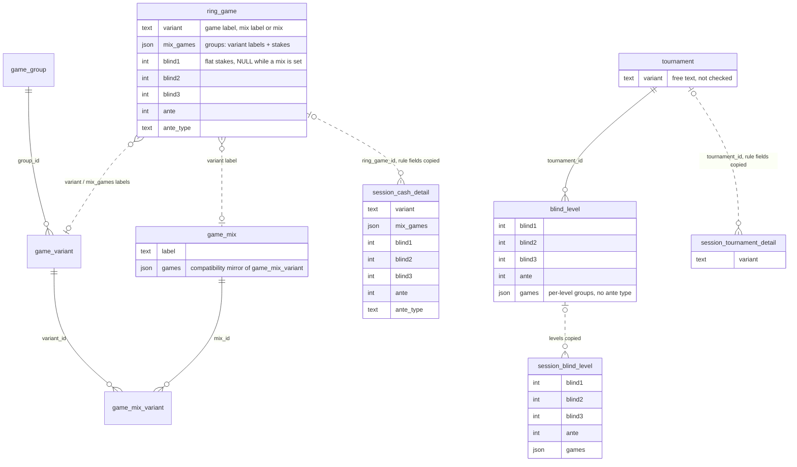
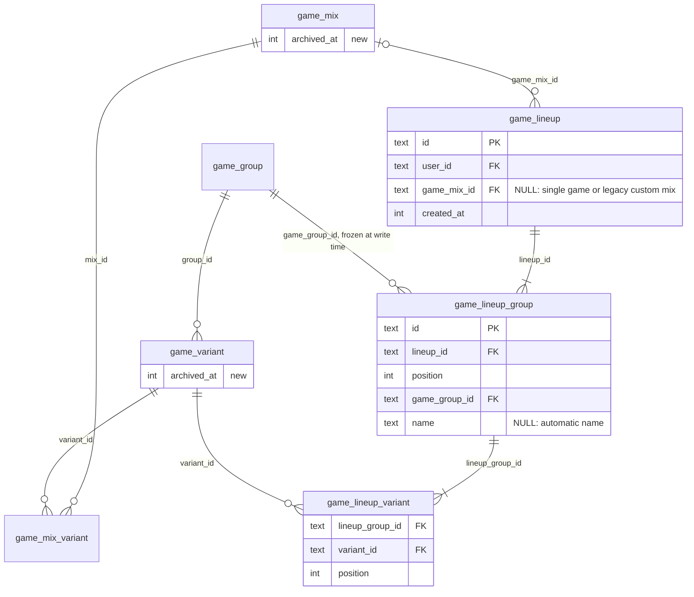
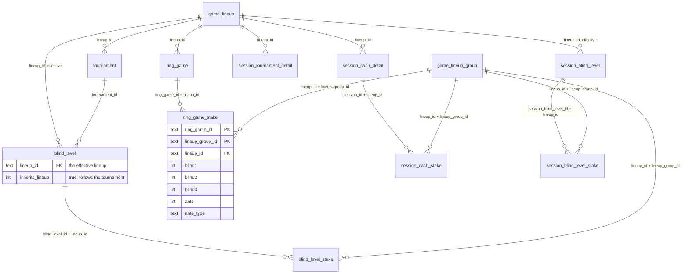

# Game Lineups (target design, SA2-242)

This is the target model for how rule masters and sessions record **which games were played and at what stakes**. It replaces the self-freezing labels of [`game-masters.md`](game-masters.md) phase by phase; until the contract phases land, `game-masters.md` still describes the running code for anything not yet switched. Decisions and phase scopes live in Linear (SA2-242 and its phase issues); this file keeps what an implementer must not lose: the model, its invariants, the ordering contracts and the migration traps.

## Status

| Phase | Issue | What lands | Release constraint | State |
|---|---|---|---|---|
| L0 | SA2-243 | `archived_at` on `game_variant` / `game_mix`; archive / restore replaces delete | no later than L1 | Planned |
| L1 | SA2-244 | Expand: lineup + stake tables, `lineup_id` on the six owners; every write path writes both models, reads stay on the legacy columns | — | Planned |
| L2 | SA2-245 | Backfill of existing rows (hand-written, re-runnable, production audited first) | a later release than L1 | Planned |
| L3 | SA2-246 | API, MCP and stats read the lineup model; inputs accept ids next to the legacy fields | a later release than L2, after the [L3 gate](#gate-before-l3) passes | Planned |
| L4a / L4b / L4c | SA2-247 / SA2-248 / SA2-249 | Web switch: rooms / live sessions / sessions, games page, stats, shared helpers | the same release as L3 or later, in any order | Planned |
| L5 | SA2-250 | Contract (code): stop writing the legacy columns, remove legacy inputs and outputs, reject legacy keys loudly | a later release than L4a–c | Planned |
| L6 | SA2-251 | Contract (migration): drop the legacy columns and the label-namespace / JSON triggers | a later release than L5 | Planned |

Production applies migrations (`db:migrate:remote`) **before** it deploys the API and then the web app, and a release bundles many PRs, so "a later deploy" means "a later release". Four boundaries need one: L1 → L2 (the backfill must not run while a Worker that writes only the legacy columns is live), L2 → L3 (reads switch only after the gate), L4 → L5 and L5 → L6 (a column is dropped only after no deployed code writes it).

## Why

The session side still stores games as text, while every other structured record (blind levels, chip purchases, tags, mix compositions since 0049) is normalized:

- `variant` does three jobs — a game label, a mix label or the `"mix"` sentinel — which forced a shared variant/mix label namespace, reserved labels and normalized-label comparisons in many places.
- References are text. Renaming a master orphans history: `stats_breakdown` splits one game into two buckets and blind-slot labels fall back to SB / BB / Straddle.
- A group's blind structure is not stored; it is inferred label → variant → `groupId`, so moving a variant to another group turns stored groups mixed (the SA2-224 frozen exemption).
- Stakes have two homes for cash (flat columns for one game, JSON for a mix) and levels a third; the mode-switch bugs c02 / c04 come from that.
- Nothing is queryable ("sessions where Razz was played") or FK-checked.

## Data model today

Solid lines are foreign keys; dotted lines are text copies resolved back to a master by normalized label.



## Target data model

Lineups — a lineup is one immutable answer to "which games, grouped by blind structure":



Owners and stakes — stakes are one row per owner and lineup group:



The other three stake tables have the same columns with their own owner key; `session_blind_level` mirrors `blind_level`. `ruleName`, `minBuyIn`, `maxBuyIn` and `tableSize` stay on the owners.

Example — a HORSE cash session and a NL Hold'em 1/2 session:

```text
game_lineup        L1  game_mix_id = HORSE
game_lineup_group  G1  L1, position 0, game_group = Limit, games [LHE, O8]
game_lineup_group  G2  L1, position 1, game_group = Stud,  games [Razz, Stud, Stud8]
session_cash_detail    lineup_id = L1   (shared with the ring game it was copied from)
session_cash_stake     (session, L1, G1) 100 / 200
session_cash_stake     (session, L1, G2) 100 / 200 / bring-in 25, ante 25 (all)

game_lineup        L2  game_mix_id = NULL, one group G3 (Big Bet) with [NLH]
session_cash_detail    lineup_id = L2
session_cash_stake     (session, L2, G3) 1 / 2
```

| Today | Target |
|---|---|
| `variant` holding a game label | a one-group, one-game lineup |
| `variant` holding a mix label | `game_lineup.game_mix_id` |
| `variant = "mix"` | a lineup without `game_mix_id` |
| `mix_games[].variants`, level `games` | `game_lineup_group` + `game_lineup_variant` |
| a level without `games` | `inherits_lineup = true`, `lineup_id` = the parent's |
| flat `blind1-3 / ante / ante_type`, stakes inside `mix_games` / `games` | the four stake tables |
| (not stored) | `game_lineup_group.game_group_id` |

## Constraints

- **Ownership composites**, as `game_mix_variant` does it: the lineup tables carry `user_id`, and references into masters are composite FKs — `(variant_id, user_id) → game_variant(id, user_id)`, `(game_mix_id, user_id) → game_mix(id, user_id)`, `(game_group_id, user_id) → game_group(id, user_id)` (the last needs a new UNIQUE index on `game_group(id, user_id)`).
- **A stake can only point at a group of its owner's current lineup, in the database.** Every stake row stores `lineup_id`, with FKs `(lineup_id, lineup_group_id) → game_lineup_group(lineup_id, id)` and `(owner_id, lineup_id) → owner(id, lineup_id)` ON DELETE CASCADE, backed by a UNIQUE index on the owner's `(id, lineup_id)`. Swapping an owner's lineup without rewriting its stakes fails with `FOREIGN KEY constraint failed` — the c02 / c04 bug class becomes a constraint violation. Levels get the same enforcement because they store their **effective** lineup: `lineup_id` always holds the lineup the level plays, and `inherits_lineup` records that it follows the parent (the API still says `game: null`).
- **Composite FKs live only on new tables.** SQLite needs a table rebuild to add a table-level FK, so the owners get `lineup_id` through `ADD COLUMN … REFERENCES game_lineup(id)` plus the UNIQUE index, declared as a Drizzle `uniqueIndex` so `schema-migrations.test.ts` matches it. That test reads only tables registered in `packages/db/src/schema.ts` and compares FKs column by column, so the rejection cases above need their own D1 integration tests.
- **NO ACTION, never RESTRICT**, for every reference into lineups and masters. RESTRICT fires immediately, in the middle of the cascade that deleting a user row starts (the lineups can go before the stakes that point at them); NO ACTION is checked at the end of the statement, when the whole account is gone.

## Invariants

1. **Lineups are immutable.** Nothing updates `game_lineup`, `game_lineup_group` or `game_lineup_variant`. Editing a composition produces a new lineup and history keeps pointing at the old one — freezing by immutability instead of by copy.
2. **One blind structure per group, checked only for games being added.** A new group takes `game_group_id` from its variants' current `groupId`, and all of them must agree. Stored lineups are never re-validated, so no frozen exemption exists; a variant that later moves to another group leaves past groups on their stored structure.
3. **A game appears at most once per lineup.**
4. **Exactly one stake row per owner and group of its lineup**, values nullable; break levels have none. That makes coverage auditable. There are no hidden stakes: P4b's "a level with games keeps its own blinds hidden for Use session game" is form-only state and is not persisted (user decision, 2026-09-25).
5. **Owners always have a lineup** once L2 has run (orphans aside, see the backfill).
6. **Archived masters are never offered for a new pick and always resolve for an existing lineup.** A pick is new when the resulting composition differs from both the owner's current lineup and its linked master's; echoing `{ lineupId }` is how a record keeps an archived game.

## Writes

### Game input

`game` is one of `{ variantId }`, `{ gameMixId }` or `{ lineupId }` (and `null` on a level: follow the parent). `stakes` lists one entry per group of the resulting lineup, in group order, and **each entry names its `gameGroupId`**; the server rejects a mismatch instead of attaching stakes to the wrong structure. Omitted `stakes` carry over (below).

- `variantId` → one group holding that variant; `game_group_id` = the variant's `groupId`; no `game_mix_id`.
- `gameMixId` → the mix's games bucketed by their current `groupId`, groups ordered by the **first appearance** of each game group in the mix's own game order (stable under renames and reproducible in SQL, unlike the label sort of `compareBuiltinFirst`); `game_mix_id` set.
- `lineupId` → used as is; this is how an unchanged selection (including a legacy custom mix, which may hold two groups of one structure) round-trips.

Every id is ownership-checked with the uniform FORBIDDEN of [`api-security.md`](../../.claude/rules/api-security.md) (a `gameLineup` branch of `validateEntityOwnership`; bulk ids through one chunked `IN` plus a count). Omitting `game` on create keeps today's inheritance: from the linked ring game or tournament if there is one, otherwise the user's builtin `nlh` variant.

### Reuse before insert

A composition's signature is `game_mix_id` plus its ordered groups of `(game_group_id, ordered variant ids)`. Before inserting a lineup, a write reuses one with the same signature from the request itself or referenced by the owner's whole structure (parent and levels) or the linked master's. So re-saving a form or a whole blind structure never churns rows. There is no global deduplication; unreferenced lineups are harmless and are not collected. Master drift (SA2-225) compares signatures — equal ids are only a shortcut, because backfilled sessions and their masters never share ids.

### Order inside one batch

- **Insert new lineup rows → delete the stakes being replaced → update or upsert the owners → insert the new stakes.** An owner cannot point at a lineup that does not exist yet, and an owner's `lineup_id` cannot change while its stakes still reference the old one. `onConflictDoUpdate` upserts of detail rows count as owner updates.
- **Replacing a parent's lineup carries the inheriting levels along in the same batch**: their `lineup_id` moves to the new lineup and their stakes carry over matched by `(game_group_id, ordinal among groups of that game group)` — never by position, since a new group order (Stud + Big Bet → 8-Game) would otherwise move Stud blinds onto Limit. Unmatched new groups start with empty values. `tournament.update`, which changes the parent without sending levels, is one of these writes.
- Resolve the final parent lineup before building any level stakes (`session.update` with both `tournamentId` and `blindLevels`).
- Every game write that now spans several statements is one `db.batch()`, including the ones that are single statements today (ring game create / update, `blindLevel.create` / `update`, `liveCashGameSession.update` / `updateSnapshot`).
- Inserts are chunked with the width taken from the table's declared columns, not a literal: `chunkForInsert(rows, 10)` for levels is at exactly 100 bind parameters today and overflows the moment `lineup_id` is added ([`data-integrity.md`](data-integrity.md)). Level counts get an input maximum, since `levels × groups` stake rows grow unbounded otherwise.

### Copies

Master → session copies share `lineup_id` and copy only the stake rows: ring game → cash session (every `resolveCashRuleSnapshot` path, including the room-less ring game that `session.create` auto-creates), tournament → tournament session, blind levels → session blind levels (`buildTournamentStructureStatements`). No deep copy of a composition exists anywhere.

## Reads

- Outputs return each lineup once, in a map keyed by id, with `gameMixId`, a display name and the groups in position order (`gameGroupId`, `name`, variants as `{ id, label, shortLabel }`). Owners reference it and carry their stakes.
- A level returns what it stores — `game: null` while it inherits — separately from its effective lineup id, so a read-modify-write never turns an inheriting level into an override.
- Names resolve live from the masters, archived rows included, through user-scoped joins: a rename shows everywhere, a composition change never reaches history. The display name is the mix's label when `game_mix_id` is set, the variant's label for a one-group, one-game lineup, and the groups' short labels otherwise.
- Unnamed groups (`name` NULL) are named after their game group at read time, numbered when a lineup has several groups of one structure.
- Hydration is batched and owner-scoped like `hydrateOwnedGameMixes` in [`services/game-mix.ts`](../../packages/api/src/services/game-mix.ts).

## Masters: archive instead of delete

Once lineups reference masters by id, a used variant or mix can no longer be deleted, so deletion is replaced (user decision, 2026-09-25):

- `game_variant` and `game_mix` gain `archived_at`; `delete` becomes `archive` / `restore`, and hard delete is removed. MCP exposes both, like `ring_game_archive` / `restore`.
- The master lists keep returning archived rows, flagged. The lists are small, and until the web switch the client resolves stored labels through them — hiding archived rows would re-label history exactly as a delete does today. Pickers and presets filter them out.
- Labels stay unique across archived rows; a conflicting create points the user at restore.
- A variant used by a non-archived mix cannot be archived (the guard today's delete has).
- `game_group` keeps hard delete. Its in-use guard counts variants (archived ones keep their group, so history keeps its slot labels) and lineup groups.

## Statistics

- The `variant` breakdown is keyed by id, in this precedence: `game_mix_id` set → `mix:<id>`; exactly one group with exactly one variant → `variant:<id>`; anything else → one "Custom mix" bucket (legacy custom mixes, copies of them, and the rooms per-level toggle until L4a removes it). Labels are the masters' current names, so future renames no longer split buckets; splits already stored under old labels stay split, because those rows resolve to placeholder masters. Tournaments use the tournament session's lineup, not the levels'.
- BB normalization, the P/L series' big blind, the session list's BB display and the `stakes` axis read the stake row when the lineup has **exactly one group**, through one aggregate join. That gives single-structure mixes (NLH / PLO) a big blind, an intended change (user decision, 2026-09-25); multi-group lineups keep having none and leave the `"0/0"` stakes bucket for a labelled one. [`statistics.md`](statistics.md) is updated when this lands.

## MCP

Inputs take ids from `game_variant_list` / `game_mix_list`, the list-then-id pattern the tools already use for rooms, currencies and tags. `MIX_RULE` and `LEVEL_GAMES_RULE` collapse into one short rule: a game is a variant id, a mix id or a lineup id from a read, and each `stakes` entry names the game group it is for. `coupling.test.ts` pins the tools that carry `mixGames` and `blindLevels`, so those checks move with the keys and gain one for `stakes` ([`mcp-tools.md`](../../.claude/rules/mcp-tools.md) rules 1 and 7). The new `game` / `stakes` inputs join the live-session restricted field lists of `session.update`.

## Migration

### Why dual write comes before the backfill

The migration that adds the tables runs while the previous Worker still serves traffic, and that Worker writes only the legacy columns. Deriving lineups from labels inside SQL triggers — what 0049 did for `game_mix_variant` — is out of reach here (label resolution, placeholders, JSON groups and stakes). Ordering replaces triggers instead: L1's Worker writes both models, and the backfill ships in a later release, when no Worker writes legacy-only rows any more. L1 never creates placeholder masters: a new label must resolve to one of the caller's masters, and a stored label that cannot resolve and is sent back unchanged leaves `lineup_id` NULL for the backfill. Rolling production back below L1 after L2 has run brings legacy-only writes back, which only a drift repair (the backfill re-run over drifted rows) fixes.

### Expand migration traps (L1)

- **Parent keys before children.** A composite FK whose parent columns have no UNIQUE index makes every DELETE on the parent fail with `foreign key mismatch` — and D1 applies a migration file statement by statement, not as one transaction, so a failure in between leaves `game_session` and account deletion broken. Order the SQL by hand: the owners' `ADD COLUMN`s, then the UNIQUE indexes (`game_group(id, user_id)`, the owners' `(id, lineup_id)`, `game_lineup_group(lineup_id, id)`), then the lineup tables, then the stake tables, all with `IF NOT EXISTS` where SQLite allows it.
- **`ADD COLUMN` cannot be guarded**, so the six `ADD COLUMN`s go in a migration file of their own and a retry never re-runs them.
- **Never add a multi-column FK to an existing owner table.** drizzle-kit would rebuild the table, and the rebuild's DROP TABLE fires cascades.
- **Owner rebuilds wipe stakes.** D1 keeps FK enforcement on during migrations, so a later rebuild of `ring_game`, `session_cash_detail`, `blind_level` or `session_blind_level` deletes their stake rows unless the children are staged first, as 0041 staged its children. No phase rebuilds an owner; NOT NULL is enforced by triggers if at all.

### Backfill rules (L2)

- **Re-runnable and self-healing**: lineup ids are derived from the owner's id with a per-table prefix (`lu:rg:`, `lu:cash:`, `lu:t:`, `lu:std:`, `lu:bl:`, `lu:sbl:`), group ids from the lineup id and position. A retry first deletes prefixed lineups that nothing references, owners are updated only `WHERE lineup_id IS NULL`, stakes use `INSERT OR IGNORE`. L6 runs it once more as a safety net. Follow [`db-migrations.md`](../../.claude/rules/db-migrations.md), and guard **every** JSON level, not only the outer array: `json_each` raises on a non-object element even when the array is valid; keep only text labels and `trim()` them.
- **Label resolution**: normalized label, then `builtinKey` (0039 converted only top-level `variant`, so pre-0039 keys such as `'nlh'` may remain inside JSON), then an archived placeholder so no data is lost. A variant and a mix may share a label in old data; a cash row resolves as a mix exactly when its `mix_games` is set. SQLite's `trim()` + `NOCASE` folds only spaces and ASCII, unlike the app's `trim().toLowerCase()`.
- **Placeholders under the 0041 triggers**: those BEFORE INSERT triggers abort before `INSERT OR IGNORE` resolves anything and check variants and mixes together, so placeholder inserts filter with a `WHERE NOT EXISTS` that mirrors the trigger on both tables, collapse duplicates with `GROUP BY user_id, trim(label) COLLATE NOCASE`, and suffix a label that collides with the other table. A placeholder variant takes the group of its resolved siblings, else the user's builtin Big Bet group, else any group of the user's. A placeholder mix is inserted through `game_mix.games` (NOT NULL, checked by the 0041 reference triggers and expanded by the 0049 compat trigger) and never through junction rows in the same pass. `seedDefaultGameData` must ignore placeholder rows, or a user whose signup seed failed would never get the builtins.
- **Mixes**: a cash `"mix"` row becomes a lineup without `game_mix_id`; a named mix label becomes `game_mix_id` with the stored composition kept, even where the master's games changed since.
- **Tournaments store no composition**: a `"mix"` tournament (the rooms per-level scope) gets an unnamed lineup of its levels' games, grouped by game group in order of first appearance; an unresolvable tournament label gets a placeholder mix built the same way, or a placeholder variant when no level has games, so flat blinds survive. A level whose games equal its parent's composition inherits; other level `games` become their own lineup, with `game_mix_id` when they equal a saved mix's composition.
- **Stakes** move from `mix_games` / level `games` or from the flat columns. A level without games under a multi-group parent copies its flat blinds to every group. The hidden flat blinds of levels that have games are dropped.
- **Groups**: stored names matching the automatic pattern ("Limit", "Big Bet 2") become NULL; a stored group whose games now span two game groups takes its first game's group.
- **Orphans**: 0033 left room-less ring games with NULL `user_id` when no session referenced them. They cannot own a lineup; they are deleted or excluded from the gate, as the L2 issue records.

### Audit before merging L2

Run against production (shapes in [`db-migrations.md`](../../.claude/rules/db-migrations.md)) and record the counts in the L2 issue: malformed JSON at any level of the four JSON columns; unresolved labels, top-level and inside JSON; non-ASCII labels; labels shared by a variant and a mix; levels whose games coexist with flat blinds (the values that will be dropped); `"mix"` tournaments and mix labels without games; groups spanning two game groups; orphan ring games.

### Gate before L3

A NULL count alone proves nothing: missing stake rows do not show up as NULLs, and a rollback can leave lineups stale. Before L3's release: no NULL `lineup_id` on owners or levels (orphans excluded), exactly one stake row per owner and group, and a drift audit that compares lineup-derived labels and stakes with the legacy columns. The gate is enforced by a migration that fails when an audit query returns rows (SQLite raises only from triggers, so insert the audit result into a NOT NULL column).

### Contract traps (L5, L6)

- The web app is an installable PWA (`registerType: "prompt"`), so stale bundles keep sending legacy fields after L5. Zod strips unknown keys, which would turn those edits into silent no-ops; L5 rejects legacy keys with an error that asks the user to reload.
- `schema-migrations.test.ts` requires the declared columns to equal the installed ones, so L5 removes the legacy columns from the Drizzle schema behind a temporary "pending drop" allowlist in that test, and L6 ships the DROPs. `game_mix.games` is NOT NULL without a default, so L5 keeps writing `'[]'` to it until L6.
- L6 order: the safety-net backfill and its assertion → drop the JSON-reference and 0049 compat triggers → drop the columns → replace 0041's cross-table variant/mix label triggers with per-table ones. Update `migration-0041.test.ts` and re-point `preview-seed-restore.test.ts` case 1 ([`testing-and-tooling.md`](testing-and-tooling.md)).

## What goes away

- Columns: `variant` (four owners), `mix_games` (two), `games` (two level tables), the flat `blind1-3 / ante / ante_type` of the four owners that have them, and `game_mix.games`.
- Mechanisms: the `"mix"` sentinel (`MIX_VARIANT`, `MIX_VARIANT_LABEL`), `RESERVED_LABELS`, the shared variant/mix label namespace (the app check and 0041's cross-table triggers, replaced by per-table ones), label-normalized lookups, the SA2-224 frozen exemption, `cashMixFlatFieldClearPatch`, the rooms per-level scope toggle.

## Related issues

- SA2-239 (retire the legacy custom mix) is absorbed: `"mix"` rows become lineups without `game_mix_id`.
- SA2-240 (tournament ante type): stake rows carry `ante_type`, so its granularity is level × group; the remaining work is UI.
- SA2-241 (Must / Optional blind slots): checked against `game_lineup_group.game_group_id`; only stakes being written are checked, so no frozen exemption.
- SA2-225 (P4c master link): game-composition drift is a signature comparison.
- SA2-238 (BlindLevelBar group stakes) reads level stake rows.
- SA2-214 (`json_valid` on JSON columns): the four game JSON columns it targets disappear in L6.
