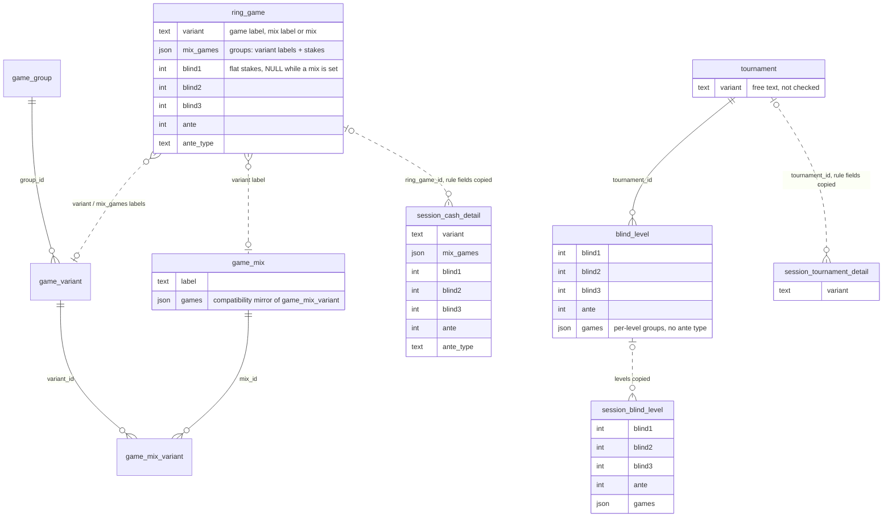
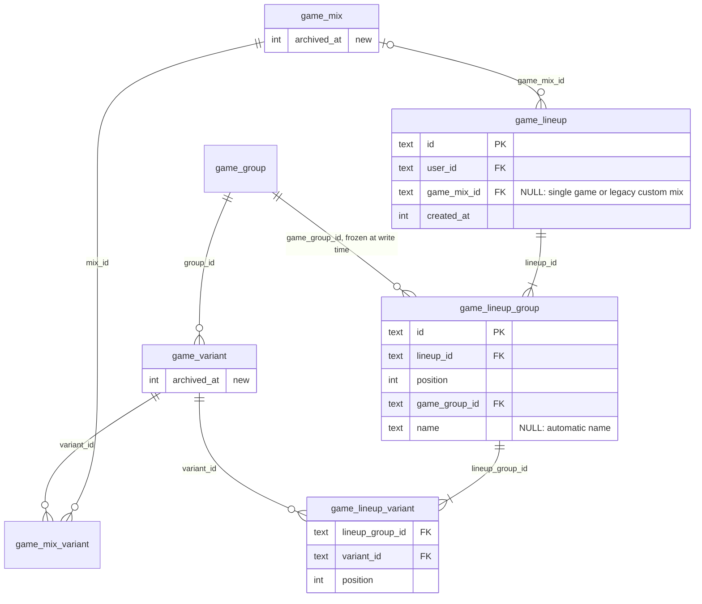
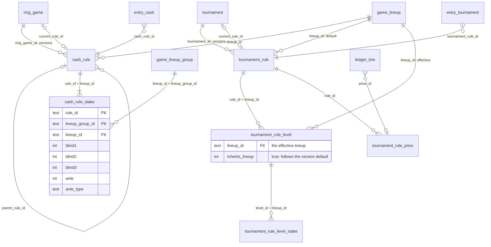

# Game Lineups and Rule Versions (target design, SA2-242 / SA2-297)

This is the target model for how rule masters and sessions record **which games were played, at what stakes, under which rules**. It replaces the self-freezing labels of [`game-masters.md`](game-masters.md) phase by phase; until the cutovers land, `game-masters.md` still describes the running code for anything not yet switched. Decisions and phase scopes live in Linear (SA2-242, SA2-297 and the phase issues); this file keeps what an implementer must not lose: the model, its invariants, the ordering contracts and the migration traps.

Since SA2-297 (open question Q5 of [`data-model-v2.md`](data-model-v2.md), decided 2026-10-06), stakes and every other rule field belong to **immutable rule versions** (`cash_rule`, `tournament_rule` and their children) instead of being copied onto each owner. A session shares its master's version until it overrides it. This turns the four stake tables of the first SA2-242 design into two and removes the session-side copies. The column definitions of the rule-version tables are in [`data-model-v2.md`](data-model-v2.md) §5.4; the two deviations from that draft are listed under [Deviations from data-model-v2.md](#deviations-from-data-model-v2md).

## Status

The phases are the P4 series of data model v2 (T27–T31). Since 2026-10-08 (SA2-330), L1 and L2 are cutovers: each PR backfills its rows and switches every read and write of them to rule versions in one deploy ([`data-model-v2.md`](data-model-v2.md) §16.1). Nothing is dual-written.

| Phase | Issue | What lands | Release constraint | State |
|---|---|---|---|---|
| L0 | SA2-243 | `archived_at` on `game_variant` / `game_mix`; archive / restore replaces delete | no later than L1 | Planned |
| L1 (T27) | SA2-244 | Cutover of the masters: lineup tables, rule-version tables and `current_rule_id` on `ring_game` / `tournament`; the master backfill and its [checks](#checks-at-the-end-of-the-cutovers); master writes and reads go through versions with today's output shape; the master rule columns, `blind_level` and `tournament_chip_purchase` are retired | after L0; record a Time Travel restore point before the release | Planned |
| L2 (T28) | SA2-245 | Cutover of the entries: `cash_rule_id` / `tournament_rule_id` on `entry_cash` / `entry_tournament` and `price_id` on `ledger_line`; the entry backfill and its checks; entries share versions, `live*.updateSnapshot` becomes `overrideRule` without an alias, master drift is a version-id comparison, chip purchase counts come from `price_id`; the session-side rule copies are retired and the normalization of `house-rules.ts` is deleted | after L1 and after data model v2 T07 (SA2-303) and T12 (SA2-308); record a Time Travel restore point before the release | Planned |
| L3 (T29) | SA2-246 | API, MCP and stats take and return ids: the lineup map in outputs, `game` / `stakes` inputs, id-keyed statistics. The legacy label inputs and outputs stay | after L2 | Planned |
| L4a / L4b / L4c (T30) | SA2-247 / SA2-248 / SA2-249 | Web switch: rooms / live sessions / sessions, games page, stats, shared helpers | the same release as L3 or later, in any order | Planned |
| L5 (T31) | SA2-250 | Remove the legacy label inputs and outputs and the label mechanisms, without a strict rejection | after L4a–c and SA2-229 | Planned |
| L6 (T31) | SA2-251 | Drop the JSON-reference and 0049 compat triggers, and replace 0041's shared variant/mix label triggers with per-table ones | the same release as L5 or later, before data model v2 T35 (SA2-324) | Planned |

Every PR ships on its own. The retired columns and tables are neither read nor written after their cutover, and stay in the database and in the Drizzle schema until data model v2 T35 (SA2-324) drops them with the rest of the retired schema.

The session-side copies (`session_cash_detail` / `session_tournament_detail` rule fields, `session_blind_level`, `session_chip_purchase`) are retired by L2. They belong to the legacy `game_session` family, which T35 drops.

## Why

The session side still stores games as text, while every other structured record (blind levels, chip purchases, tags, mix compositions since 0049) is normalized:

- `variant` does three jobs — a game label, a mix label or the `"mix"` sentinel — which forced a shared variant/mix label namespace, reserved labels and normalized-label comparisons in many places.
- References are text. Renaming a master orphans history: `stats_breakdown` splits one game into two buckets and blind-slot labels fall back to SB / BB / Straddle.
- A group's blind structure is not stored; it is inferred label → variant → `groupId`, so moving a variant to another group turns stored groups mixed (the SA2-224 frozen exemption).
- Stakes have two homes for cash (flat columns for one game, JSON for a mix) and levels a third; the mode-switch bugs c02 / c04 come from that.
- Nothing is queryable ("sessions where Razz was played") or FK-checked.

Rules are also copied: every session copies its master's rule fields, blind levels and chip purchases, so master drift is a column-by-column comparison with normalization (`house-rules.ts`), and the first SA2-242 design needed a stake table per owner (four). Immutable rule versions make a session point at the version it played instead.

## Data model today

Solid lines are foreign keys; dotted lines are text copies resolved back to a master by normalized label.


```mermaid
erDiagram
    game_group ||--o{ game_variant : "group_id"
    game_variant ||--o{ game_mix_variant : "variant_id"
    game_mix ||--o{ game_mix_variant : "mix_id"
    ring_game }o..o| game_variant : "variant / mix_games labels"
    ring_game }o..o| game_mix : "variant label"
    ring_game |o..o{ session_cash_detail : "ring_game_id, rule fields copied"
    tournament ||--o{ blind_level : "tournament_id"
    tournament |o..o{ session_tournament_detail : "tournament_id, rule fields copied"
    blind_level |o..o{ session_blind_level : "levels copied"
    game_mix {
        text label
        json games "compatibility mirror of game_mix_variant"
    }
    ring_game {
        text variant "game label, mix label or mix"
        json mix_games "groups: variant labels + stakes"
        int blind1 "flat stakes, NULL while a mix is set"
        int blind2
        int blind3
        int ante
        text ante_type
    }
    session_cash_detail {
        text variant
        json mix_games
        int blind1
        int blind2
        int blind3
        int ante
        text ante_type
    }
    tournament {
        text variant "free text, not checked"
    }
    session_tournament_detail {
        text variant
    }
    blind_level {
        int blind1
        int blind2
        int blind3
        int ante
        json games "per-level groups, no ante type"
    }
    session_blind_level {
        int blind1
        int blind2
        int blind3
        int ante
        json games
    }
```

## Target data model

Lineups — a lineup is one immutable answer to "which games, grouped by blind structure":


```mermaid
erDiagram
    game_group ||--o{ game_variant : "group_id"
    game_mix ||--o{ game_mix_variant : "mix_id"
    game_variant ||--o{ game_mix_variant : "variant_id"
    game_mix |o--o{ game_lineup : "game_mix_id"
    game_lineup ||--|{ game_lineup_group : "lineup_id"
    game_group ||--o{ game_lineup_group : "game_group_id, frozen at write time"
    game_lineup_group ||--|{ game_lineup_variant : "lineup_group_id"
    game_variant ||--o{ game_lineup_variant : "variant_id"
    game_variant {
        int archived_at "new"
    }
    game_mix {
        int archived_at "new"
    }
    game_lineup {
        text id PK
        text user_id FK
        text game_mix_id FK "NULL: single game or legacy custom mix"
        int created_at
    }
    game_lineup_group {
        text id PK
        text lineup_id FK
        int position
        text game_group_id FK
        text name "NULL: automatic name"
    }
    game_lineup_variant {
        text lineup_group_id FK
        text variant_id FK
        int position
    }
```

Rule versions — a version is one immutable answer to "which lineup, at what stakes, under which rules". Masters point at their current version; entries point at the version they played:


```mermaid
erDiagram
    ring_game ||--o{ cash_rule : "ring_game_id: versions"
    ring_game |o--o| cash_rule : "current_rule_id"
    cash_rule |o--o{ cash_rule : "parent_rule_id"
    game_lineup ||--o{ cash_rule : "lineup_id"
    cash_rule ||--|{ cash_rule_stake : "rule_id + lineup_id"
    game_lineup_group ||--o{ cash_rule_stake : "lineup_id + lineup_group_id"
    entry_cash }o--|| cash_rule : "cash_rule_id"
    tournament ||--o{ tournament_rule : "tournament_id: versions"
    tournament |o--o| tournament_rule : "current_rule_id"
    game_lineup ||--o{ tournament_rule : "lineup_id: default"
    tournament_rule ||--o{ tournament_rule_level : "rule_id + lineup_id"
    game_lineup ||--o{ tournament_rule_level : "lineup_id: effective"
    tournament_rule_level ||--o{ tournament_rule_level_stake : "level_id + lineup_id"
    tournament_rule ||--o{ tournament_rule_price : "rule_id"
    entry_tournament }o--|| tournament_rule : "tournament_rule_id"
    ledger_line }o--o| tournament_rule_price : "price_id"
    cash_rule_stake {
        text rule_id PK
        text lineup_group_id PK
        text lineup_id FK
        int blind1
        int blind2
        int blind3
        int ante
        text ante_type
    }
    tournament_rule_level {
        text lineup_id FK "the effective lineup"
        int inherits_lineup "true: follows the version default"
    }
```

`tournament_rule_level_stake` has the same columns as `cash_rule_stake` with `level_id` as its owner key. The scalar rule fields (`min_buy_in`, `max_buy_in`, `table_size`, `house_rules` on `cash_rule`; `starting_stack`, `table_size`, `bounty_amount`, `house_rules` on `tournament_rule`) move off the masters into the version. Buy-ins, re-entries and chip purchases become `tournament_rule_price` rows (`kind` = entry / reentry / chip_purchase, with the paying asset), so a tournament that accepts cash or a ticket has two entry prices. `ring_game.currency_id` stays as the master's default asset.

Example — a HORSE ring game, a stake raise, and a live session with a one-off rule:

```text
game_lineup        L1  game_mix_id = HORSE
game_lineup_group  G1  L1, position 0, game_group = Limit, games [LHE, O8]
game_lineup_group  G2  L1, position 1, game_group = Stud,  games [Razz, Stud, Stud8]
cash_rule          R1  ring_game = HORSE, lineup L1, buy-in 4,000-20,000
cash_rule_stake    (R1, L1, G1) 100 / 200
cash_rule_stake    (R1, L1, G2) 100 / 200 / bring-in 25, ante 25 (all)
ring_game          current_rule_id = R1
entry_cash         cash_rule_id = R1           (a session at the game shares the version)

the room raises the stakes
cash_rule          R2  ring_game = HORSE, parent R1, lineup L1 (same composition, reused)
cash_rule_stake    (R2, L1, G1) 200 / 400, (R2, L1, G2) 200 / 400 / bring-in 50, ante 50
ring_game          current_rule_id = R2        (sessions on R1 keep R1)

a live session plays one evening at a different buy-in cap
cash_rule          R3  ring_game = HORSE, parent R2, lineup L1, buy-in 4,000-40,000
entry_cash         cash_rule_id = R3           (the master stays on R2; drift = R3 <> R2)
```

| Today | Target |
|---|---|
| `variant` holding a game label | a one-group, one-game lineup |
| `variant` holding a mix label | `game_lineup.game_mix_id` |
| `variant = "mix"` | a lineup without `game_mix_id` |
| `mix_games[].variants`, level `games` | `game_lineup_group` + `game_lineup_variant` |
| a level without `games` | `inherits_lineup = true`, `lineup_id` = the version default |
| flat `blind1-3 / ante / ante_type`, stakes inside `mix_games` / `games` | `cash_rule_stake` / `tournament_rule_level_stake` |
| rule fields on `ring_game` / `tournament` | columns of the master's current version |
| rule fields copied onto session detail rows, `session_blind_level`, `session_chip_purchase` | the entry's `cash_rule_id` / `tournament_rule_id` (the shared version, or a child version for an override) |
| `blind_level`, `tournament_chip_purchase` | `tournament_rule_level`, `tournament_rule_price` |
| (not stored) | `game_lineup_group.game_group_id` |

## Deviations from data-model-v2.md

Recorded in SA2-297 and applied to [`data-model-v2.md`](data-model-v2.md):

1. **`tournament_rule_level.lineup_id` is NOT NULL and holds the effective lineup**, with `inherits_lineup` recording that the level follows the version default — SA2-242 decision 2, kept. The data-model-v2 draft had "NULL inherits", which would leave level stakes outside the composite FK below (a NULL FK column is not checked). The API still says `game: null` for an inheriting level.
2. **L2 adds `ledger_line.price_id`** (moved from L1 on 2026-10-08), so L2 waits for data model v2 T12 (SA2-308), the cutover that fills `ledger_line`. L2 fills the column for the chip purchase lines T12 created, and every chip purchase line written after it carries the column.
3. **A version's reference to its master is ON DELETE CASCADE**, not NO ACTION: `(ring_game_id, user_id) → ring_game` on `cash_rule` and `(tournament_id, user_id) → tournament` on `tournament_rule`. Every master has a current version from L1 on, so NO ACTION from its own versions would make every `ringGame.delete` / `tournament.delete` fail, and every `room.delete` too, since it cascades to the room's ring games and tournaments, even when no entry uses the master. A master's versions belong to its aggregate (CASCADE inside an aggregate, data-model-v2 §5.1), and INV-22 still holds in the database through the entries' NO ACTION references ([Masters: archive instead of delete](#masters-archive-instead-of-delete)).

## Constraints

- **Ownership composites**, as `game_mix_variant` does it: the lineup and rule-version tables carry `user_id`, and references into masters and versions are composite FKs — `(variant_id, user_id) → game_variant(id, user_id)`, `(game_mix_id, user_id) → game_mix(id, user_id)`, `(game_group_id, user_id) → game_group(id, user_id)` (the last needs a new UNIQUE index on `game_group(id, user_id)`), `(ring_game_id, user_id) → ring_game(id, user_id)` and `(tournament_id, user_id) → tournament(id, user_id)` (data model v2 T02 adds those UNIQUE indexes), `(lineup_id, user_id) → game_lineup(id, user_id)`, `(parent_rule_id, user_id)` into the same table.
- **A stake can only point at a group of its version's lineup, in the database.** Every stake row stores `lineup_id`, with FKs `(lineup_id, lineup_group_id) → game_lineup_group(lineup_id, id)` and `(rule_id, lineup_id) → cash_rule(id, lineup_id)` ON DELETE CASCADE (levels: `(level_id, lineup_id) → tournament_rule_level(id, lineup_id)`), backed by UNIQUE indexes on `(id, lineup_id)`; the ownership FK `(rule_id, user_id)` (`(level_id, user_id)`) stays alongside. Versions are immutable, so no write swaps a lineup under existing stakes any more; the FK rejects a version assembled with stakes from another lineup, which is the c02 / c04 bug class.
- **An inheriting level stores its version's default lineup.** When `inherits_lineup` is true, `tournament_rule_level.lineup_id` equals `tournament_rule.lineup_id`. A CHECK cannot read the parent row, so the API writes it and the checks at the end of L1 and L2 count violations.
- **Composite FKs live only on new tables.** SQLite needs a table rebuild to add a table-level FK. The rule-version tables are new and get full composites; the five columns added to existing tables (`ring_game.current_rule_id`, `tournament.current_rule_id`, `entry_cash.cash_rule_id`, `entry_tournament.tournament_rule_id`, `ledger_line.price_id`) are single-column FKs added with `ADD COLUMN … REFERENCES`, guarded by `validateEntityOwnership` on write and by audit A-7 ([`data-model-v2.md`](data-model-v2.md) §5.3, INV-02). `schema-migrations.test.ts` reads only tables registered in `packages/db/src/schema.ts` and compares FKs column by column, so the rejection cases need their own D1 integration tests.
- **NO ACTION, never RESTRICT**, for every reference into lineups, versions and masters, except a version's reference to its own master, which is CASCADE ([deviation 3](#deviations-from-data-model-v2md)). RESTRICT fires immediately, in the middle of the cascade that deleting a user row starts (the lineups can go before the versions that point at them); NO ACTION is checked at the end of the statement, when the whole account is gone.

## Invariants

1. **Lineups are immutable.** Nothing updates `game_lineup`, `game_lineup_group` or `game_lineup_variant`. Editing a composition produces a new lineup.
2. **Rule versions are immutable** (INV-16). Nothing updates `cash_rule`, `tournament_rule` or their children. Editing a master inserts a version whose `parent_rule_id` is the previous current one and re-points `current_rule_id`; entries keep the version they played — freezing by immutability instead of by copy.
3. **One blind structure per group, checked only for games being added.** A new group takes `game_group_id` from its variants' current `groupId`, and all of them must agree. Stored lineups are never re-validated, so no frozen exemption exists; a variant that later moves to another group leaves past groups on their stored structure.
4. **A game appears at most once per lineup.**
5. **Exactly one stake row per version (or level) and group of its lineup**, values nullable; break levels have none. That makes coverage auditable. There are no hidden stakes: P4b's "a level with games keeps its own blinds hidden for Use session game" is form-only state and is not persisted (user decision, 2026-09-25).
6. **Every master has a current version** once L1 has run, **and every entry linked to a master or carrying rules has a version** once L2 has run.
7. **A version belongs to its referrers' owner** (INV-17): a master or entry points only at versions of the same user, and a version with `ring_game_id` / `tournament_id` set is a version of that master.
8. **Archived masters are never offered for a new pick and always resolve for an existing lineup.** A pick is new when the resulting composition differs from both the entry's current version and its linked master's; echoing `{ lineupId }` is how a record keeps an archived game.
9. **A master's versions stay with that master.** A child version takes its parent's `ring_game_id` / `tournament_id`, and a master's `current_rule_id` points only at one of its own versions. Outside the master, then, only entries and their ledger lines reference its versions, which is what lets deleting a master cascade to them ([Masters](#masters-archive-instead-of-delete)); a reference from another master or another master's version would turn that delete into a raw FK error.

## Writes

### Game input

`game` is one of `{ variantId }`, `{ gameMixId }` or `{ lineupId }` (and `null` on a level: follow the version default). `stakes` lists one entry per group of the resulting lineup, in group order, and **each entry names its `gameGroupId`**; the server rejects a mismatch instead of attaching stakes to the wrong structure. Omitted `stakes` carry over (below).

- `variantId` → one group holding that variant; `game_group_id` = the variant's `groupId`; no `game_mix_id`.
- `gameMixId` → the mix's games bucketed by their current `groupId`, groups ordered by the **first appearance** of each game group in the mix's own game order (stable under renames and reproducible in SQL, unlike the label sort of `compareBuiltinFirst`); `game_mix_id` set.
- `lineupId` → used as is; this is how an unchanged selection (including a legacy custom mix, which may hold two groups of one structure) round-trips.

Every id is ownership-checked with the uniform FORBIDDEN of [`api-security.md`](../../.claude/rules/api-security.md) (`gameLineup`, `cashRule`, `tournamentRule` and `tournamentRulePrice` branches of `validateEntityOwnership`; bulk ids through one chunked `IN` plus a count). Omitting `game` on create keeps today's inheritance: from the linked ring game or tournament if there is one, otherwise the user's builtin `nlh` variant.

### Reuse before insert

- A composition's signature is `game_mix_id` plus its ordered groups of `(game_group_id, ordered variant ids)`. Before inserting a lineup, a write reuses one with the same signature from the request itself, the entry's current version or the linked master's current version. There is no global deduplication; unreferenced lineups are harmless and are not collected.
- A version's signature is its lineup id, its scalar rule fields, its stakes, and for tournaments its levels (with their effective lineups and stakes) and prices. A write whose resulting signature equals the current version's reuses that version instead of inserting one, so re-saving an unchanged form never churns versions.

### Order inside one batch

- **Insert new lineup rows → insert the version → insert its stakes, levels, level stakes and prices → re-point the master's `current_rule_id` and/or the entry's rule id.** Nothing in the lineup or rule tables is updated or deleted. A master or entry cannot point at a version that does not exist yet.
- **Changing a version's default lineup carries the inheriting levels along**: in the new version, inheriting levels point at the new lineup and their stakes carry over from the previous version matched by `(game_group_id, ordinal among groups of that game group)` — never by position, since a new group order (Stud + Big Bet → 8-Game) would otherwise move Stud blinds onto Limit. Unmatched new groups start with empty values. `tournament.update`, which changes the default without sending levels, is one of these writes.
- Every rule write is one `db.batch()`, including the ones that are single statements today (ring game create / update, `blindLevel.create` / `update`, `liveCashGameSession.update` / `updateSnapshot`). `blindLevel.*` edits of one level produce a new version of the whole tournament rule.
- Inserts are chunked with the width taken from the table's declared columns, not a literal ([`data-integrity.md`](data-integrity.md)). Level counts get an input maximum, since `levels × groups` stake rows grow unbounded otherwise.

### Entries share versions

- An entry created from a master takes `rule_id = master.current_rule_id`. Nothing is copied: the copy paths (`resolveCashRuleSnapshot`, including the room-less ring game that `session.create` auto-creates, and `buildTournamentStructureStatements`) are replaced by sharing the id.
- An entry without a master that has rules gets a parentless version of its own.
- Changing rules inside a session (`live*.updateSnapshot`, renamed `overrideRule` at L2) inserts a child version whose parent is the entry's current version and re-points only the entry. Applying the master's newer rules re-points the entry to `current_rule_id`; pushing a session's rules to the master ("Update master") re-points the master to the entry's version when it is one of the master's, and otherwise inserts an equal version under the master (parent = its current one) and re-points both (invariant 9).
- Master drift (SA2-225) is `entry.rule_id <> master.current_rule_id`. What differs is a comparison of two immutable versions — exact, with no normalization; the per-column comparison and the normalization of `house-rules.ts` go away at L2.

## Reads

- L1 assembles the masters' outputs and L2 the entries' outputs from versions, in today's shape. From L3 the outputs also carry ids; new outputs are additive.
- Outputs return each lineup once, in a map keyed by id, with `gameMixId`, a display name and the groups in position order (`gameGroupId`, `name`, variants as `{ id, label, shortLabel }`). Versions reference it and carry their stakes.
- A level returns what it stores — `game: null` while it inherits — separately from its effective lineup id, so a read-modify-write never turns an inheriting level into an override.
- Names resolve live from the masters, archived rows included, through user-scoped joins: a rename shows everywhere, a composition change never reaches history. The display name is the mix's label when `game_mix_id` is set, the variant's label for a one-group, one-game lineup, and the groups' short labels otherwise.
- Unnamed groups (`name` NULL) are named after their game group at read time, numbered when a lineup has several groups of one structure.
- Hydration is batched and owner-scoped like `hydrateOwnedGameMixes` in [`services/game-mix.ts`](../../packages/api/src/services/game-mix.ts).
- Chip purchase counts are the ledger lines that carry the purchase's `price_id` ([`data-model-v2.md`](data-model-v2.md) §12), not a stored count.

## Masters: archive instead of delete

Once lineups reference masters by id, a used variant or mix can no longer be deleted, so deletion is replaced (user decision, 2026-09-25):

- `game_variant` and `game_mix` gain `archived_at`; `delete` becomes `archive` / `restore`, and hard delete is removed. MCP exposes both, like `ring_game_archive` / `restore`.
- The master lists keep returning archived rows, flagged. The lists are small, and until the web switch the client resolves stored labels through them — hiding archived rows would re-label history exactly as a delete does today. Pickers and presets filter them out.
- Labels stay unique across archived rows; a conflicting create points the user at restore.
- A variant used by a non-archived mix cannot be archived (the guard today's delete has).
- `game_group` keeps hard delete. Its in-use guard counts variants (archived ones keep their group, so history keeps its slot labels) and lineup groups.
- A ring game or tournament that an entry links, or one of whose versions an entry uses, cannot be deleted (data model v2 INV-22); it is archived instead. One that no entry uses can still be deleted, by the same single DELETE as today: [deviation 3](#deviations-from-data-model-v2md) cascades its versions and their stakes, levels and prices in the same statement, and the master's `current_rule_id` and the versions' `parent_rule_id` point only among the deleted rows (invariant 9), so their NO ACTION does not fire. The API check before the delete counts both kinds of entry reference and returns CONFLICT; the entries' NO ACTION FKs (`entry_cash.cash_rule_id`, `entry_tournament.tournament_rule_id`, `ledger_line.price_id`) back it. `room.delete` cascades to its masters, so its check counts the same references for every master in the room. L2's D1 integration tests cover both outcomes for each of the three deletes.

## Statistics

- The `variant` breakdown is keyed by id, in this precedence: `game_mix_id` set → `mix:<id>`; exactly one group with exactly one variant → `variant:<id>`; anything else → one "Custom mix" bucket (legacy custom mixes, copies of them, and the rooms per-level toggle until L4a removes it). Labels are the masters' current names, so future renames no longer split buckets; splits already stored under old labels stay split, because those rows resolve to placeholder masters. Tournaments use the default lineup of the entry's version, not the levels'.
- BB normalization, the P/L series' big blind, the session list's BB display and the `stakes` axis read the stake row when the lineup has **exactly one group**, through one aggregate join. That gives single-structure mixes (NLH / PLO) a big blind, an intended change (user decision, 2026-09-25); multi-group lineups keep having none and leave the `"0/0"` stakes bucket for a labelled one. [`statistics.md`](statistics.md) is updated when this lands.
- **Phasing**: L2 retires the session-side columns these readers use today, so from L2 they read versions while keeping today's shape: the breakdown is keyed by the lineup's display name, and the big blind comes from the stake row only for a lineup of one group with one variant, the case the flat columns covered. L3 switches the keys to ids and gives every one-group lineup its big blind.

## MCP

Inputs take ids from `game_variant_list` / `game_mix_list`, the list-then-id pattern the tools already use for rooms, currencies and tags. `MIX_RULE` and `LEVEL_GAMES_RULE` collapse into one short rule: a game is a variant id, a mix id or a lineup id from a read, and each `stakes` entry names the game group it is for. `ringGame.update` and `tournament.updateWithLevels` keep their tool schemas while they create a version and re-point the master ([`data-model-v2.md`](data-model-v2.md) §14.2). `coupling.test.ts` pins the tools that carry `mixGames` and `blindLevels`, so those checks move with the keys and gain one for `stakes` ([`mcp-tools.md`](../../.claude/rules/mcp-tools.md) rules 1 and 7). The new `game` / `stakes` inputs join the live-session restricted field lists of `session.update`.

## Migration

### Cutovers instead of dual writes

L1 and L2 each backfill their rows and switch every read and write of them to versions in the same PR, so after the deploy no Worker writes legacy-only rows. The earlier design reached the same point by dual-writing first and backfilling a release later; that is no longer needed with one production user and D1 Time Travel ([`data-model-v2.md`](data-model-v2.md) §16). Two consequences remain:

- Deriving lineups and versions inside SQL triggers — what 0049 did for `game_mix_variant` — stays out of reach (label resolution, placeholders, JSON groups and stakes), so the backfill is hand-written SQL.
- Production applies the migration before it deploys the new Worker, and the previous Worker writes only the legacy columns. Do not enter data while a cutover release deploys, and record the Time Travel restore point before it.

After L1 the API never creates placeholder masters: a new label must resolve to one of the caller's masters, and only the backfill creates placeholders.

### Table migration traps (L1, L2)

- **Parent keys before children.** A composite FK whose parent columns have no UNIQUE index makes every DELETE on the parent fail with `foreign key mismatch` — and D1 applies a migration file statement by statement, not as one transaction, so a failure in between leaves account deletion broken. Order the SQL by hand: `game_group(id, user_id)`, then the lineup tables with their `(id, user_id)` and `(lineup_id, id)` indexes, then the rule tables with their `(id, user_id)` and `(id, lineup_id)` indexes, then the stake and price tables.
- **The five `ADD COLUMN`s split across the cutovers**: L1 adds `current_rule_id` to `ring_game` and `tournament`, and L2 adds `entry_cash.cash_rule_id`, `entry_tournament.tournament_rule_id` and `ledger_line.price_id`.
- **Never add a multi-column FK to an existing table.** drizzle-kit would rebuild it, and the rebuild's DROP TABLE fires cascades.
- **Never rebuild a rule table.** D1 keeps FK enforcement on during migrations, so rebuilding `cash_rule`, `tournament_rule` or `tournament_rule_level` would cascade-delete stakes, levels and prices, and NO ACTION references from masters and entries would abort it. Add columns with `ADD COLUMN` only.

### Backfill rules (L1 for masters, L2 for entries)

- **Versions per master, shared by equal snapshots.** L1 gives each master one current version with a deterministic id (`cr:<ring_game_id>`, `tr:<tournament_id>`). In L2, an entry whose stored rule snapshot equals its master's version points at that version; an entry that differs gets a child version (`cr:e:<entry_id>` / `tr:e:<entry_id>`, parent = the master's version), and an entry without a master gets a parentless one under the same id scheme. Entries with equal snapshots under one master share the child built for the first of them, so an unchanged series of sessions does not multiply versions. "Equal" is decided once, in SQL, with the normalization `house-rules.ts` applies today.
- **Deterministic ids**: every row id is derived from its source — lineups from the version or level id (`lu:<version id>`, `lu:<level id>`), groups from the lineup id and position, levels from the blind level (`trl:<blind_level id>`, `trl:e:<session_blind_level id>` in a child version), prices from the purchase (`trp:<tournament_chip_purchase id>`, `trp:e:<session_chip_purchase id>`) or the version (`trp:<version id>:entry`). Each backfill runs once; a failure is restored with Time Travel and released again, not re-run from the middle ([`data-model-v2.md`](data-model-v2.md) §16.3). Follow [`db-migrations.md`](../../.claude/rules/db-migrations.md), and guard **every** JSON level, not only the outer array: `json_each` raises on a non-object element even when the array is valid; keep only text labels and `trim()` them.
- **Label resolution**: normalized label, then `builtinKey` (0039 converted only top-level `variant`, so pre-0039 keys such as `'nlh'` may remain inside JSON), then an archived placeholder so no data is lost. A variant and a mix may share a label in old data; a cash row resolves as a mix exactly when its `mix_games` is set. SQLite's `trim()` + `NOCASE` folds only spaces and ASCII, unlike the app's `trim().toLowerCase()`.
- **Placeholders under the 0041 triggers**: those BEFORE INSERT triggers abort before `INSERT OR IGNORE` resolves anything and check variants and mixes together, so placeholder inserts filter with a `WHERE NOT EXISTS` that mirrors the trigger on both tables, collapse duplicates with `GROUP BY user_id, trim(label) COLLATE NOCASE`, and suffix a label that collides with the other table. A placeholder variant takes the group of its resolved siblings, else the user's builtin Big Bet group, else any group of the user's. A placeholder mix is inserted through `game_mix.games` (NOT NULL, checked by the 0041 reference triggers and expanded by the 0049 compat trigger) and never through junction rows in the same pass. `seedDefaultGameData` must ignore placeholder rows, or a user whose signup seed failed would never get the builtins.
- **Mixes**: a cash `"mix"` row becomes a lineup without `game_mix_id`; a named mix label becomes `game_mix_id` with the stored composition kept, even where the master's games changed since.
- **Tournaments store no composition**: a `"mix"` tournament (the rooms per-level scope) gets an unnamed lineup of its levels' games, grouped by game group in order of first appearance; an unresolvable tournament label gets a placeholder mix built the same way, or a placeholder variant when no level has games, so flat blinds survive. A level whose games equal the version default inherits; other level `games` become their own lineup, with `game_mix_id` when they equal a saved mix's composition.
- **Stakes** move from `mix_games` / level `games` or from the flat columns. A level without games under a multi-group default copies its flat blinds to every group. The hidden flat blinds of levels that have games are dropped.
- **Prices** come from the master's or snapshot's buy-in, fee and chip purchases (`kind` = entry, chip_purchase); `ledger_line.price_id` is filled for the chip purchase lines that data model v2 T12 created, matched to the entry version's chip purchase prices by their position in the stored snapshot.
- **Groups**: stored names matching the automatic pattern ("Limit", "Big Bet 2") become NULL; a stored group whose games now span two game groups takes its first game's group.
- **Orphans**: data model v2 T02 (SA2-296) made `ring_game.user_id` NOT NULL, so no ring game without an owner remains.

### Optional audit before L1 and L2

Run against production (shapes in [`db-migrations.md`](../../.claude/rules/db-migrations.md)) only for the cases whose treatment depends on the counts, and record them in the issue: malformed JSON at any level of the four JSON columns; unresolved labels, top-level and inside JSON; non-ASCII labels; labels shared by a variant and a mix; levels whose games coexist with flat blinds (the values that will be dropped); `"mix"` tournaments and mix labels without games; groups spanning two game groups; the number of entries whose snapshot differs from their master (the child versions the backfill creates).

### Checks at the end of the cutovers

A NULL count alone proves nothing: missing stake rows do not show up as NULLs. L1's migration ends with these checks: no NULL `current_rule_id` on masters, exactly one stake row per master version (or level) and group, no inheriting level whose lineup differs from its version's, and the master half of audit A-13 (the values of every master's version equal the legacy columns). L2's ends with no NULL rule id on entries that have a master or rules, the same stake coverage for entry versions, audit A-7 (the five single-column FKs point only at the same user's rows), and the entry half of A-13. Each check is a statement that fails when an audit query returns rows (SQLite raises only from triggers, so insert the audit result into a NOT NULL column; [`data-model-v2.md`](data-model-v2.md) §16.4).

### Removal traps (L5, L6, T35)

- L5 removes the legacy inputs without a strict rejection. Production has one user, who reloads the installable PWA (`registerType: "prompt"`) after a release ([`data-model-v2.md`](data-model-v2.md) §14.1).
- The retired columns and tables stay in the Drizzle schema until T35, so `schema-migrations.test.ts` needs no pending-drop allowlist. `game_mix.games` is NOT NULL without a default, so from L5 on, writes put `'[]'` in it until T35 drops it.
- L6 drops the JSON-reference and 0049 compat triggers, then replaces 0041's cross-table variant/mix label triggers with per-table ones. It needs no safety-net backfill: after the cutovers no code writes the legacy columns. Update `migration-0041.test.ts` and re-point `preview-seed-restore.test.ts` case 1 ([`testing-and-tooling.md`](testing-and-tooling.md)).
- T35 drops the master rule columns (SQLite drops only columns without a FK, index or CHECK; check each first), then `blind_level` and `tournament_chip_purchase` (child tables, so dropping them cascades nothing upward).

## What goes away

- Columns, all dropped in data model v2 T35: on `ring_game` — `variant`, `mix_games`, `blind1-3`, `ante`, `ante_type`, `min_buy_in`, `max_buy_in`, `table_size`, `house_rules`, and on `tournament` — `variant`, `buy_in`, `entry_fee`, `starting_stack`, `bounty_amount`, `table_size`, `house_rules` (retired by L1); `game_mix.games` (written as `'[]'` from L5).
- Tables: `blind_level` and `tournament_chip_purchase`, and the session-side copies with the legacy `game_session` family, all dropped in data model v2 T35.
- Mechanisms: the `"mix"` sentinel (`MIX_VARIANT`, `MIX_VARIANT_LABEL`), `RESERVED_LABELS`, the shared variant/mix label namespace (the app check and 0041's cross-table triggers, replaced by per-table ones), label-normalized lookups, the SA2-224 frozen exemption, `cashMixFlatFieldClearPatch`, the rooms per-level scope toggle, the rule snapshot copy paths, and the per-column drift comparison with the normalization of `house-rules.ts`.

## Related issues

- SA2-239 (retire the legacy custom mix) is absorbed: `"mix"` rows become lineups without `game_mix_id`.
- SA2-240 (tournament ante type): stake rows carry `ante_type`, so its granularity is level × group; the remaining work is UI.
- SA2-241 (Must / Optional blind slots): checked against `game_lineup_group.game_group_id`; only stakes being written are checked, so no frozen exemption.
- SA2-225 (P4c master link): drift is a version-id comparison, and what changed is a comparison of two versions.
- SA2-238 (BlindLevelBar group stakes) reads level stake rows.
- SA2-214 (`json_valid` on JSON columns): the four game JSON columns it targets disappear in data model v2 T35.
